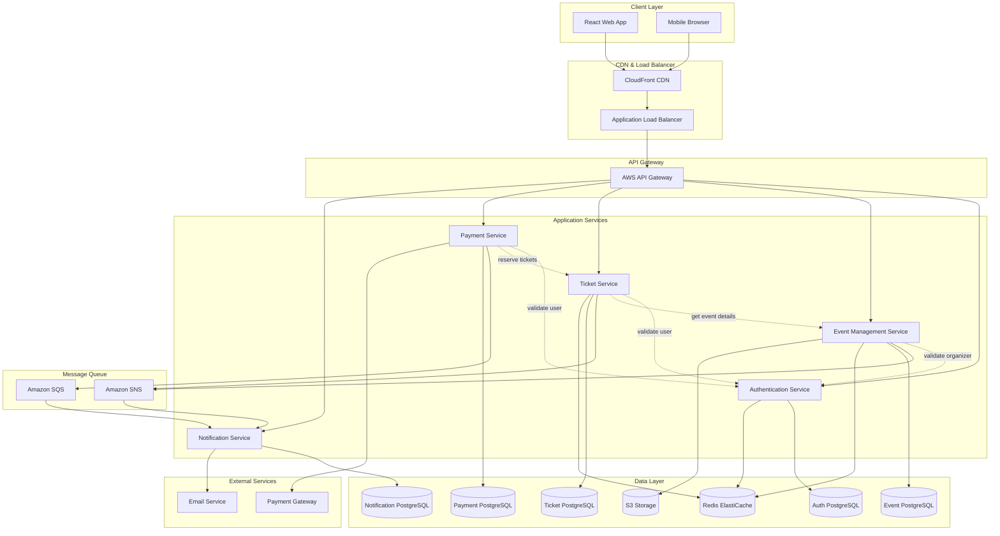
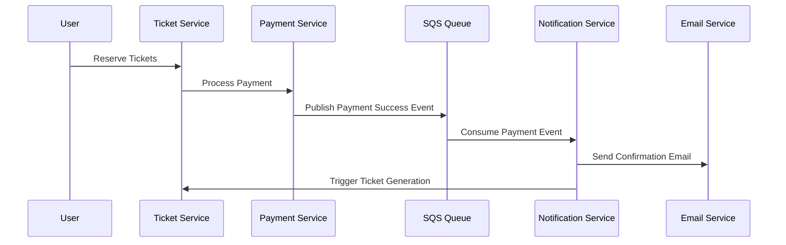

# Design Document

## Overview

The Event Ticket Booking System MVP is designed as a modern, scalable web application that enables secure ticket purchasing and event management. The system follows a microservices architecture pattern deployed on AWS cloud infrastructure, ensuring high availability, security, and performance during peak ticket sales periods.

### Key Design Principles

- **Security First**: PCI DSS compliance for payment processing and GDPR compliance for data protection
- **High Availability**: 99.9% uptime with automatic failover and recovery mechanisms
- **Scalability**: Horizontal scaling to handle 1000+ concurrent users during peak periods
- **Performance**: Sub-2-second response times for critical user flows
- **Data Consistency**: ACID transactions for ticket inventory and payment processing

## Architecture

### High-Level Architecture



### Microservices Architecture

The system is decomposed into focused microservices, each responsible for a specific business domain. Services communicate through both synchronous and asynchronous patterns to maintain loose coupling while ensuring data consistency.

#### Inter-Service Communication Patterns

**Synchronous Communication (HTTP/REST)**
- **Authentication Validation**: All services call Auth Service to validate JWT tokens and user permissions
- **Event Details Retrieval**: Ticket Service calls Event Management Service to get event information during ticket operations
- **User Validation**: Payment and Ticket services validate user existence through Auth Service
- **Inventory Checks**: Payment Service calls Ticket Service to verify availability before processing payments

**Asynchronous Communication (Message Queues)**
- **Payment Events**: Payment Service publishes events to SQS for order confirmations and failures
- **Event Updates**: Event Management Service publishes to SNS when events are created, updated, or cancelled
- **Ticket Events**: Ticket Service publishes events for ticket generation and delivery status
- **Notification Processing**: Notification Service consumes messages from SQS/SNS to send emails

**Event-Driven Architecture**


#### Authentication Service
- User registration and login
- Email verification
- Password reset functionality
- JWT token management
- Session management with Redis

#### Event Management Service
- Event creation and editing
- Event search and filtering
- Event categorization
- Image upload and management

#### Ticket Service
- Ticket inventory management
- Ticket selection and reservation
- Digital ticket generation with QR codes
- Ticket delivery coordination

#### Payment Service
- Payment processing integration
- Order management
- Transaction integrity
- PCI DSS compliance

#### Notification Service
- Email notifications
- Delivery status tracking
- Template management
- Retry mechanisms

### Service Communication Details

#### Synchronous Communication Protocols
- **Protocol**: HTTP/HTTPS with REST APIs
- **Authentication**: JWT tokens passed in Authorization headers
- **Timeout**: 5-second timeout for inter-service calls
- **Circuit Breaker**: Hystrix pattern for fault tolerance
- **Load Balancing**: Service discovery through AWS ECS service mesh

#### Asynchronous Messaging
- **Message Broker**: Amazon SQS for point-to-point messaging
- **Event Bus**: Amazon SNS for publish-subscribe patterns
- **Message Format**: JSON with event schema versioning
- **Delivery Guarantee**: At-least-once delivery with idempotency keys
- **Dead Letter Queues**: Failed message handling and retry logic

#### Data Consistency Patterns
- **Saga Pattern**: Distributed transactions across services for ticket purchasing
- **Event Sourcing**: Payment and ticket state changes tracked as events
- **CQRS**: Separate read/write models for high-performance queries
- **Eventual Consistency**: Non-critical data synchronized asynchronously

#### Service Discovery and Configuration
- **Service Registry**: AWS ECS Service Discovery
- **Configuration Management**: AWS Parameter Store for environment-specific settings
- **Health Checks**: HTTP endpoints for service health monitoring
- **API Versioning**: Header-based versioning for backward compatibility

## Components and Interfaces

### Frontend Components (React)

#### Core Components
- **AuthenticationModule**: Login, registration, password reset forms
- **EventBrowser**: Search, filtering, and event listing components
- **EventDetails**: Event information display and ticket selection
- **CheckoutFlow**: Multi-step checkout process with payment integration
- **UserDashboard**: Order history, ticket management, profile settings
- **OrganizerDashboard**: Event creation, management, and analytics

#### Shared Components
- **Layout**: Header, navigation, footer components
- **Forms**: Reusable form components with validation
- **UI Elements**: Buttons, modals, loading states, error displays

### Backend Services (Spring Boot)

#### API Endpoints

**Authentication Service**
```
POST /api/auth/register
POST /api/auth/verify-email
POST /api/auth/login
POST /api/auth/logout
POST /api/auth/forgot-password
POST /api/auth/reset-password
GET  /api/auth/profile
```

**Event Management Service**
```
GET    /api/events
GET    /api/events/{id}
POST   /api/events
PUT    /api/events/{id}
DELETE /api/events/{id}
GET    /api/events/search
POST   /api/events/{id}/image
```

**Ticket Service**
```
GET  /api/tickets/availability/{eventId}
POST /api/tickets/reserve
POST /api/tickets/purchase
GET  /api/tickets/orders/{userId}
GET  /api/tickets/{ticketId}
POST /api/tickets/{ticketId}/resend
```

**Payment Service**
```
POST /api/payments/process
GET  /api/payments/orders/{orderId}
POST /api/payments/refund
GET  /api/payments/methods
```

**Notification Service**
```
POST /api/notifications/send
GET  /api/notifications/status/{id}
POST /api/notifications/templates
```

### Integration Interfaces

#### Payment Gateway Integration
- **Stripe API**: Primary payment processor
- **PayPal API**: Alternative payment method
- **Webhook handling**: Real-time payment status updates
- **PCI DSS compliance**: Tokenization and secure data handling

#### Email Service Integration
- **Amazon SES**: Primary email delivery service
- **SendGrid**: Backup email service
- **Template management**: HTML and text email templates
- **Delivery tracking**: Bounce and complaint handling

## Data Models

### Database-per-Service Architecture

Each microservice maintains its own dedicated database to ensure loose coupling and independent scalability. Services communicate through APIs and events rather than shared database access.

#### Authentication Service Database

```sql
-- Users table in Authentication Service Database
CREATE TABLE users (
    id UUID PRIMARY KEY DEFAULT gen_random_uuid(),
    email VARCHAR(255) UNIQUE NOT NULL,
    password_hash VARCHAR(255) NOT NULL,
    first_name VARCHAR(100) NOT NULL,
    last_name VARCHAR(100) NOT NULL,
    date_of_birth DATE NOT NULL,
    email_verified BOOLEAN DEFAULT FALSE,
    created_at TIMESTAMP DEFAULT CURRENT_TIMESTAMP,
    updated_at TIMESTAMP DEFAULT CURRENT_TIMESTAMP
);

-- User sessions for JWT management
CREATE TABLE user_sessions (
    id UUID PRIMARY KEY DEFAULT gen_random_uuid(),
    user_id UUID NOT NULL REFERENCES users(id),
    token_hash VARCHAR(255) NOT NULL,
    expires_at TIMESTAMP NOT NULL,
    created_at TIMESTAMP DEFAULT CURRENT_TIMESTAMP
);
```

#### Event Management Service Database

```sql
-- Events table with user reference by ID only
CREATE TABLE events (
    id UUID PRIMARY KEY DEFAULT gen_random_uuid(),
    organizer_id UUID NOT NULL, -- Reference to user in Auth service
    name VARCHAR(255) NOT NULL,
    description TEXT,
    event_date TIMESTAMP NOT NULL,
    venue_name VARCHAR(255) NOT NULL,
    venue_address TEXT NOT NULL,
    category VARCHAR(100),
    image_url VARCHAR(500),
    status VARCHAR(50) DEFAULT 'DRAFT',
    created_at TIMESTAMP DEFAULT CURRENT_TIMESTAMP,
    updated_at TIMESTAMP DEFAULT CURRENT_TIMESTAMP
);

-- Event categories lookup
CREATE TABLE event_categories (
    id UUID PRIMARY KEY DEFAULT gen_random_uuid(),
    name VARCHAR(100) UNIQUE NOT NULL,
    description TEXT
);
```

#### Ticket Service Database
```sql
-- Ticket types with event reference by ID only
CREATE TABLE ticket_types (
    id UUID PRIMARY KEY DEFAULT gen_random_uuid(),
    event_id UUID NOT NULL, -- Reference to event in Event service
    name VARCHAR(255) NOT NULL,
    description TEXT,
    price DECIMAL(10,2) NOT NULL,
    quantity_available INTEGER NOT NULL,
    quantity_sold INTEGER DEFAULT 0,
    sale_start_date TIMESTAMP,
    sale_end_date TIMESTAMP,
    per_person_limit INTEGER DEFAULT 10,
    venue_zone VARCHAR(100),
    created_at TIMESTAMP DEFAULT CURRENT_TIMESTAMP
);

-- Ticket reservations for temporary holds
CREATE TABLE ticket_reservations (
    id UUID PRIMARY KEY DEFAULT gen_random_uuid(),
    user_id UUID NOT NULL, -- Reference to user in Auth service
    ticket_type_id UUID NOT NULL REFERENCES ticket_types(id),
    quantity INTEGER NOT NULL,
    reserved_until TIMESTAMP NOT NULL,
    created_at TIMESTAMP DEFAULT CURRENT_TIMESTAMP
);

-- Generated tickets
CREATE TABLE tickets (
    id UUID PRIMARY KEY DEFAULT gen_random_uuid(),
    ticket_type_id UUID NOT NULL REFERENCES ticket_types(id),
    order_id UUID NOT NULL, -- Reference to order in Payment service
    ticket_number VARCHAR(50) UNIQUE NOT NULL,
    qr_code VARCHAR(255) UNIQUE NOT NULL,
    holder_name VARCHAR(255),
    status VARCHAR(50) DEFAULT 'ACTIVE',
    created_at TIMESTAMP DEFAULT CURRENT_TIMESTAMP
);
```

#### Payment Service Database
```sql
-- Orders with references to other services by ID
CREATE TABLE orders (
    id UUID PRIMARY KEY DEFAULT gen_random_uuid(),
    user_id UUID NOT NULL, -- Reference to user in Auth service
    event_id UUID NOT NULL, -- Reference to event in Event service
    order_number VARCHAR(50) UNIQUE NOT NULL,
    total_amount DECIMAL(10,2) NOT NULL,
    payment_status VARCHAR(50) DEFAULT 'PENDING',
    payment_method VARCHAR(50),
    payment_gateway_transaction_id VARCHAR(255),
    created_at TIMESTAMP DEFAULT CURRENT_TIMESTAMP,
    updated_at TIMESTAMP DEFAULT CURRENT_TIMESTAMP
);

-- Order line items for detailed tracking
CREATE TABLE order_items (
    id UUID PRIMARY KEY DEFAULT gen_random_uuid(),
    order_id UUID NOT NULL REFERENCES orders(id),
    ticket_type_id UUID NOT NULL, -- Reference to ticket type in Ticket service
    quantity INTEGER NOT NULL,
    unit_price DECIMAL(10,2) NOT NULL,
    total_price DECIMAL(10,2) NOT NULL
);

-- Payment transactions for audit trail
CREATE TABLE payment_transactions (
    id UUID PRIMARY KEY DEFAULT gen_random_uuid(),
    order_id UUID NOT NULL REFERENCES orders(id),
    gateway_transaction_id VARCHAR(255),
    amount DECIMAL(10,2) NOT NULL,
    currency VARCHAR(3) DEFAULT 'USD',
    status VARCHAR(50) NOT NULL,
    gateway_response TEXT,
    created_at TIMESTAMP DEFAULT CURRENT_TIMESTAMP
);
```

#### Notification Service Database

```sql
-- Notification templates
CREATE TABLE notification_templates (
    id UUID PRIMARY KEY DEFAULT gen_random_uuid(),
    name VARCHAR(100) UNIQUE NOT NULL,
    subject VARCHAR(255) NOT NULL,
    html_content TEXT NOT NULL,
    text_content TEXT NOT NULL,
    created_at TIMESTAMP DEFAULT CURRENT_TIMESTAMP
);

-- Notification delivery tracking
CREATE TABLE notifications (
    id UUID PRIMARY KEY DEFAULT gen_random_uuid(),
    user_id UUID NOT NULL, -- Reference to user in Auth service
    template_id UUID NOT NULL REFERENCES notification_templates(id),
    recipient_email VARCHAR(255) NOT NULL,
    subject VARCHAR(255) NOT NULL,
    status VARCHAR(50) DEFAULT 'PENDING',
    sent_at TIMESTAMP,
    delivery_status VARCHAR(50),
    error_message TEXT,
    created_at TIMESTAMP DEFAULT CURRENT_TIMESTAMP
);
```

### Data Consistency Across Services

Since each service has its own database, we need strategies to maintain data consistency:

#### Reference Data Management
- **User References**: Services store only user IDs and call Auth Service for user details
- **Event References**: Services store event IDs and call Event Service for event details
- **Cross-Service Queries**: Use API calls or event-driven updates for data synchronization

#### Event-Driven Data Synchronization
- **User Updates**: Auth Service publishes user change events
- **Event Updates**: Event Service publishes event lifecycle events
- **Order Events**: Payment Service publishes order status changes
- **Ticket Events**: Ticket Service publishes ticket generation events

### Caching Strategy (Redis)

#### Session Management
- **Key Pattern**: `session:{userId}`
- **TTL**: 24 hours
- **Data**: User session information, authentication tokens

#### Event Caching
- **Key Pattern**: `event:{eventId}`
- **TTL**: 1 hour
- **Data**: Event details, ticket availability

#### Search Results Caching
- **Key Pattern**: `search:{hash(query)}`
- **TTL**: 15 minutes
- **Data**: Paginated search results

#### Inventory Caching
- **Key Pattern**: `inventory:{eventId}:{ticketTypeId}`
- **TTL**: 5 minutes
- **Data**: Real-time ticket availability

## Error Handling

### Error Response Format
```json
{
  "error": {
    "code": "VALIDATION_ERROR",
    "message": "Invalid input provided",
    "details": [
      {
        "field": "email",
        "message": "Email address is required"
      }
    ],
    "timestamp": "2024-01-15T10:30:00Z",
    "requestId": "req_123456789"
  }
}
```

### Error Categories

#### Client Errors (4xx)
- **400 Bad Request**: Invalid input validation
- **401 Unauthorized**: Authentication required
- **403 Forbidden**: Insufficient permissions
- **404 Not Found**: Resource not found
- **409 Conflict**: Inventory conflicts, duplicate resources

#### Server Errors (5xx)
- **500 Internal Server Error**: Unexpected system errors
- **502 Bad Gateway**: External service failures
- **503 Service Unavailable**: System maintenance, overload
- **504 Gateway Timeout**: External service timeouts

### Error Handling Strategies

#### Circuit Breaker Pattern
- **Payment Gateway**: 5 failures trigger 30-second circuit open
- **Email Service**: 3 failures trigger 60-second circuit open
- **Database**: Connection pool monitoring and failover

#### Retry Mechanisms
- **Exponential Backoff**: 1s, 2s, 4s, 8s intervals
- **Maximum Retries**: 3 attempts for transient failures
- **Dead Letter Queue**: Failed messages for manual processing

#### Graceful Degradation
- **Search Service**: Fallback to basic search if advanced features fail
- **Image Service**: Default placeholder images if CDN unavailable
- **Notification Service**: Queue messages for later delivery

## Testing Strategy

### Unit Testing
- **Coverage Target**: 80% code coverage for critical paths
- **Framework**: JUnit 5 for Spring Boot services, Jest for React components
- **Mocking**: Mockito for service dependencies, Mock Service Worker for API calls
- **Test Categories**: Business logic, validation, error handling

### Integration Testing
- **API Testing**: REST Assured for endpoint testing
- **Database Testing**: Testcontainers for PostgreSQL integration
- **External Services**: WireMock for payment gateway and email service simulation
- **End-to-End Flows**: Complete user journeys from registration to ticket purchase

### Performance Testing
- **Load Testing**: JMeter scripts for 1000+ concurrent users
- **Stress Testing**: Gradual load increase to identify breaking points
- **Spike Testing**: Sudden traffic spikes simulation
- **Endurance Testing**: Extended load periods for memory leaks

### Security Testing
- **Authentication Testing**: JWT token validation, session management
- **Authorization Testing**: Role-based access control verification
- **Input Validation**: SQL injection, XSS prevention
- **PCI DSS Compliance**: Payment data handling verification

### Automated Testing Pipeline
- **Pre-commit Hooks**: Code quality checks, unit tests
- **CI/CD Pipeline**: Automated test execution on pull requests
- **Staging Environment**: Full integration testing before production
- **Production Monitoring**: Synthetic transaction monitoring

## Deployment Architecture

### AWS Infrastructure

#### Compute Services
- **ECS Fargate**: Containerized microservices deployment
- **Application Load Balancer**: Traffic distribution and SSL termination
- **Auto Scaling Groups**: Horizontal scaling based on CPU and memory metrics

#### Database Services
- **RDS PostgreSQL**: Multi-AZ deployment with read replicas
- **ElastiCache Redis**: Cluster mode for high availability
- **S3**: Static asset storage with CloudFront CDN

#### Security Services
- **AWS WAF**: Web application firewall protection
- **AWS Secrets Manager**: Secure credential storage
- **AWS KMS**: Encryption key management

#### Monitoring Services
- **CloudWatch**: Metrics, logs, and alerting
- **X-Ray**: Distributed tracing
- **AWS Config**: Configuration compliance monitoring

### Deployment Strategy
- **Blue-Green Deployment**: Zero-downtime deployments
- **Feature Flags**: Gradual feature rollout and quick rollback
- **Database Migrations**: Backward-compatible schema changes
- **Health Checks**: Automated deployment verification