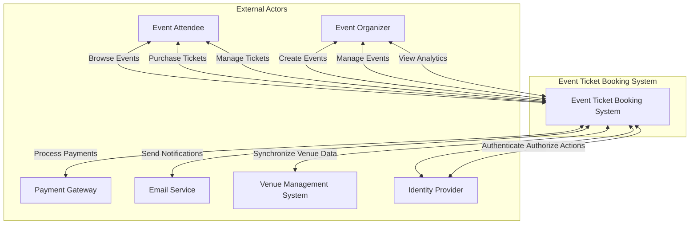

# Event Ticket Booking System - Vision Document

## 1. Introduction

The Event Ticket Booking System is a comprehensive platform designed to revolutionize the way people purchase and manage event tickets. This system aims to provide a seamless, secure, and user-friendly experience for both event organizers and attendees, similar to industry leaders but with modern features and enhanced user experience.

## 2. Business Context

The event ticketing industry has evolved significantly in recent years, with increasing demand for digital solutions that offer convenience, security, and flexibility. Key business drivers include:

- Growing demand for digital ticket management
- Need for secure and reliable payment processing
- Increasing importance of mobile-first solutions
- Demand for real-time inventory management
- Need for fraud prevention and ticket authenticity verification
- Growing importance of data analytics for event organizers
- Increasing focus on user experience and customer satisfaction

## 3. Vision of the Solution

### 3.1 Vision Sentence

To create a modern, secure, and scalable event ticket booking platform that provides a seamless experience for both event organizers and attendees, enabling easy ticket purchase, management, and validation while ensuring security and preventing fraud.

### 3.2 Main Features of the Solution

| ID | Feature Name | Description |
|----|--------------|-------------|
| F1 | User Authentication | Secure user registration and login with multi-factor authentication support |
| F2 | Event Management | Create, update, and manage event listings with detailed information |
| F3 | Ticket Inventory Management | Real-time inventory tracking and management for different ticket types |
| F4 | Ticket Purchase | Secure and streamlined ticket purchasing process with multiple payment options |
| F5 | Digital Ticket Generation | Generate and manage digital tickets with QR codes and unique identifiers |
| F6 | Ticket Transfer | Allow users to transfer tickets to other users securely |
| F7 | Ticket Resale | Enable users to resell tickets through the platform with price controls |
| F8 | Event Search and Discovery | Advanced search and filtering options for finding events |
| F9 | Seat Selection | Interactive seat map for selecting specific seats in venues |
| F10 | Mobile Ticket Validation | Mobile app for ticket validation at event venues |
| F11 | Event Analytics | Comprehensive analytics dashboard for event organizers |
| F12 | Waitlist Management | Allow users to join waitlists for sold-out events |
| F13 | Price Dynamic Pricing | Implement dynamic pricing based on demand and time |
| F14 | Social Integration | Share events and tickets on social media platforms |
| F15 | Email Notifications | Automated email notifications for important updates |
| F16 | Customer Support | Integrated customer support system with ticket management |
| F17 | Venue Management | Manage multiple venues and their seating configurations |
| F18 | Promotional Codes | Support for promotional codes and special offers |
| F19 | Multiple Currency Support | Support for different currencies and exchange rates |
| F20 | Event Recommendations | Personalized event recommendations based on user preferences |

## 4. Scope of the Project (MVP)

For the initial MVP, we will focus on the following core features:

1. User Authentication (F1)
   - Basic user registration and login
   - Email verification

2. Event Management (F2)
   - Basic event creation and management
   - Essential event information fields

3. Ticket Inventory Management (F3)
   - Basic inventory tracking
   - Simple ticket types (e.g., general admission)

4. Ticket Purchase (F4)
   - Secure payment processing
   - Basic checkout flow

5. Digital Ticket Generation (F5)
   - Basic digital ticket generation
   - QR code generation

6. Event Search and Discovery (F8)
   - Basic search functionality
   - Simple filtering options

7. Email Notifications (F15)
   - Essential email notifications
   - Purchase confirmations

## 5. System Context

### External Actors

| Actor | Description |
|-------|-------------|
| Event Attendee | Individual users who browse, purchase, and manage event tickets |
| Event Organizer | Users who create and manage events, view analytics, and handle ticket sales |
| Payment Gateway | External service that processes financial transactions and payments |
| Email Service | External service that handles the delivery of email notifications and communications |
| Venue Management System | External system that manages venue information, seating arrangements, and capacity |
| Identity Provider | External service that handles user authentication, authorization, and identity management |

### System Access
The system will be accessible through:
- Web browsers on desktop and mobile devices
- Native mobile applications for iOS and Android

### Quality Attributes
The system must exhibit the following quality attributes:

#### Performance
- Handle high concurrent user loads during peak ticket sales
- Provide fast response times for all user interactions
- Support real-time inventory updates

#### Security
- Protect user data and payment information
- Prevent unauthorized access and fraud
- Ensure secure ticket validation

#### Scalability
- Support growing user base and event volume
- Handle seasonal traffic spikes
- Process high volumes of transactions

#### Reliability
- Maintain system availability during critical periods
- Ensure data consistency and integrity
- Provide backup and recovery capabilities

#### Usability
- Intuitive and responsive user interface
- Consistent experience across platforms
- Accessible to users with different needs

#### Maintainability
- Support regular updates and improvements
- Enable monitoring and troubleshooting
- Facilitate feature additions

The system will be designed to:
- Meet the needs of both event organizers and attendees
- Support business growth and expansion
- Adapt to changing market requirements
- Provide a competitive advantage in the ticketing industry 