# Event Ticket System - Architecture Documentation

This document provides a comprehensive architectural overview of the Event Ticket Booking System using the C4 model approach, along with detailed sequence diagrams for each functional requirement.

## Table of Contents

1. [C4 Context Diagram](#c4-context-diagram)
2. [C4 Container Diagram](#c4-container-diagram)
3. [Component Diagrams](#component-diagrams)
   - [Auth Service](#auth-service-components)
   - [Event Service](#event-service-components)
   - [Ticket Service](#ticket-service-components)
   - [Payment Service](#payment-service-components)
   - [Notification Service](#notification-service-components)
4. [Sequence Diagrams](#sequence-diagrams)

---

## C4 Context Diagram

The Context Diagram shows the Event Ticket System and how it fits into the world around it.

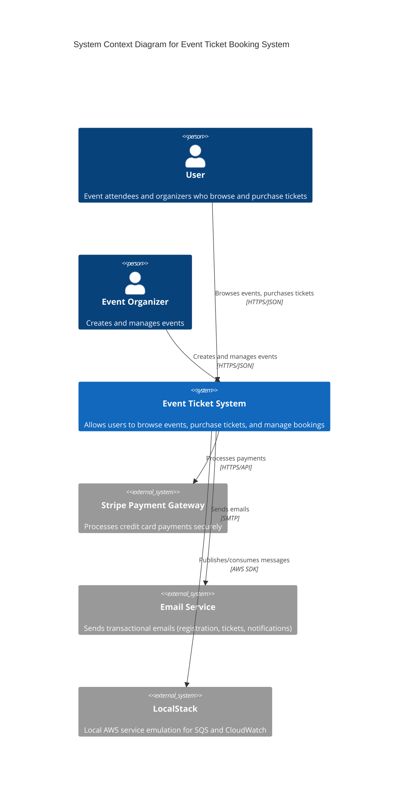
```mermaid
C4Context
    title System Context Diagram for Event Ticket Booking System

    Person(user, "User", "Event attendees and organizers who browse and purchase tickets")
    Person(organizer, "Event Organizer", "Creates and manages events")
    
    System(eventTicketSystem, "Event Ticket System", "Allows users to browse events, purchase tickets, and manage bookings")
    
    System_Ext(stripeGateway, "Stripe Payment Gateway", "Processes credit card payments securely")
    System_Ext(emailService, "Email Service", "Sends transactional emails (registration, tickets, notifications)")
    System_Ext(localStorage, "LocalStack", "Local AWS service emulation for SQS and CloudWatch")
    
    Rel(user, eventTicketSystem, "Browses events, purchases tickets", "HTTPS/JSON")
    Rel(organizer, eventTicketSystem, "Creates and manages events", "HTTPS/JSON")
    Rel(eventTicketSystem, stripeGateway, "Processes payments", "HTTPS/API")
    Rel(eventTicketSystem, emailService, "Sends emails", "SMTP")
    Rel(eventTicketSystem, localStorage, "Publishes/consumes messages", "AWS SDK")
```

---

## C4 Container Diagram

The Container Diagram shows the high-level technology choices and how containers communicate.

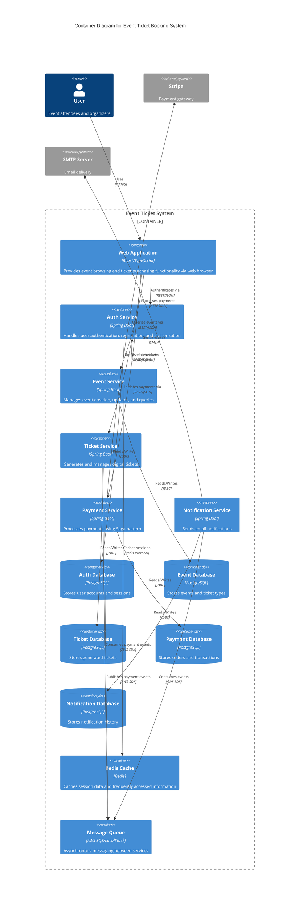
```mermaid
C4Container
    title Container Diagram for Event Ticket Booking System

    Person(user, "User", "Event attendees and organizers")
    
    Container_Boundary(c1, "Event Ticket System") {
        Container(webApp, "Web Application", "React/TypeScript", "Provides event browsing and ticket purchasing functionality via web browser")
        Container(authService, "Auth Service", "Spring Boot", "Handles user authentication, registration, and authorization")
        Container(eventService, "Event Service", "Spring Boot", "Manages event creation, updates, and queries")
        Container(ticketService, "Ticket Service", "Spring Boot", "Generates and manages digital tickets")
        Container(paymentService, "Payment Service", "Spring Boot", "Processes payments using Saga pattern")
        Container(notificationService, "Notification Service", "Spring Boot", "Sends email notifications")
        
        ContainerDb(authDb, "Auth Database", "PostgreSQL", "Stores user accounts and sessions")
        ContainerDb(eventDb, "Event Database", "PostgreSQL", "Stores events and ticket types")
        ContainerDb(ticketDb, "Ticket Database", "PostgreSQL", "Stores generated tickets")
        ContainerDb(paymentDb, "Payment Database", "PostgreSQL", "Stores orders and transactions")
        ContainerDb(notificationDb, "Notification Database", "PostgreSQL", "Stores notification history")
        
        Container(redis, "Redis Cache", "Redis", "Caches session data and frequently accessed information")
        Container(messageQueue, "Message Queue", "AWS SQS/LocalStack", "Asynchronous messaging between services")
    }
    
    System_Ext(stripe, "Stripe", "Payment gateway")
    System_Ext(smtp, "SMTP Server", "Email delivery")
    
    Rel(user, webApp, "Uses", "HTTPS")
    Rel(webApp, authService, "Authenticates via", "REST/JSON")
    Rel(webApp, eventService, "Queries events via", "REST/JSON")
    Rel(webApp, ticketService, "Retrieves tickets via", "REST/JSON")
    Rel(webApp, paymentService, "Initiates payments via", "REST/JSON")
    
    Rel(authService, authDb, "Reads/Writes", "JDBC")
    Rel(authService, redis, "Caches sessions", "Redis Protocol")
    
    Rel(eventService, eventDb, "Reads/Writes", "JDBC")
    Rel(eventService, authService, "Validates tokens", "REST/JSON")
    
    Rel(ticketService, ticketDb, "Reads/Writes", "JDBC")
    Rel(ticketService, messageQueue, "Consumes payment events", "AWS SDK")
    
    Rel(paymentService, paymentDb, "Reads/Writes", "JDBC")
    Rel(paymentService, stripe, "Processes payments", "HTTPS/API")
    Rel(paymentService, messageQueue, "Publishes payment events", "AWS SDK")
    
    Rel(notificationService, notificationDb, "Reads/Writes", "JDBC")
    Rel(notificationService, smtp, "Sends emails", "SMTP")
    Rel(notificationService, messageQueue, "Consumes events", "AWS SDK")
```

---

## Component Diagrams

### Auth Service Components

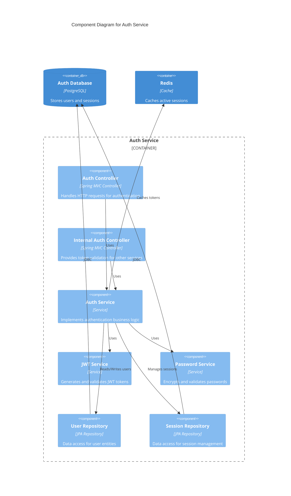
```mermaid
C4Component
    title Component Diagram for Auth Service

    Container_Boundary(authService, "Auth Service") {
        Component(authController, "Auth Controller", "Spring MVC Controller", "Handles HTTP requests for authentication")
        Component(internalAuthController, "Internal Auth Controller", "Spring MVC Controller", "Provides token validation for other services")
        Component(authServiceImpl, "Auth Service", "Service", "Implements authentication business logic")
        Component(jwtService, "JWT Service", "Service", "Generates and validates JWT tokens")
        Component(passwordEncoder, "Password Service", "Service", "Encrypts and validates passwords")
        Component(userRepository, "User Repository", "JPA Repository", "Data access for user entities")
        Component(sessionRepository, "Session Repository", "JPA Repository", "Data access for session management")
    }
    
    ContainerDb(authDb, "Auth Database", "PostgreSQL", "Stores users and sessions")
    Container(redis, "Redis", "Cache", "Caches active sessions")
    
    Rel(authController, authServiceImpl, "Uses")
    Rel(internalAuthController, authServiceImpl, "Uses")
    Rel(authServiceImpl, jwtService, "Uses")
    Rel(authServiceImpl, passwordEncoder, "Uses")
    Rel(authServiceImpl, userRepository, "Reads/Writes users")
    Rel(authServiceImpl, sessionRepository, "Manages sessions")
    Rel(userRepository, authDb, "JDBC")
    Rel(sessionRepository, authDb, "JDBC")
    Rel(authServiceImpl, redis, "Caches tokens")
```

### Event Service Components

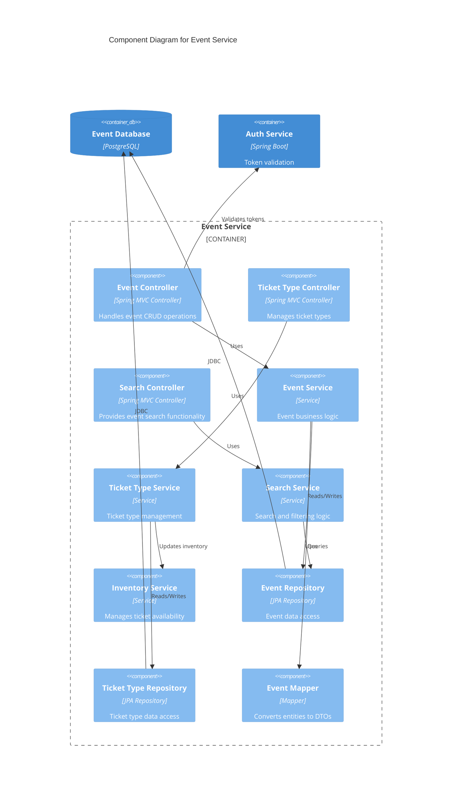
```mermaid
C4Component
    title Component Diagram for Event Service

    Container_Boundary(eventService, "Event Service") {
        Component(eventController, "Event Controller", "Spring MVC Controller", "Handles event CRUD operations")
        Component(ticketTypeController, "Ticket Type Controller", "Spring MVC Controller", "Manages ticket types")
        Component(searchController, "Search Controller", "Spring MVC Controller", "Provides event search functionality")
        Component(eventServiceImpl, "Event Service", "Service", "Event business logic")
        Component(ticketTypeServiceImpl, "Ticket Type Service", "Service", "Ticket type management")
        Component(searchServiceImpl, "Search Service", "Service", "Search and filtering logic")
        Component(inventoryService, "Inventory Service", "Service", "Manages ticket availability")
        Component(eventRepository, "Event Repository", "JPA Repository", "Event data access")
        Component(ticketTypeRepository, "Ticket Type Repository", "JPA Repository", "Ticket type data access")
        Component(eventMapper, "Event Mapper", "Mapper", "Converts entities to DTOs")
    }
    
    ContainerDb(eventDb, "Event Database", "PostgreSQL")
    Container(authService, "Auth Service", "Spring Boot", "Token validation")
    
    Rel(eventController, eventServiceImpl, "Uses")
    Rel(ticketTypeController, ticketTypeServiceImpl, "Uses")
    Rel(searchController, searchServiceImpl, "Uses")
    Rel(eventServiceImpl, eventRepository, "Reads/Writes")
    Rel(ticketTypeServiceImpl, ticketTypeRepository, "Reads/Writes")
    Rel(ticketTypeServiceImpl, inventoryService, "Updates inventory")
    Rel(searchServiceImpl, eventRepository, "Queries")
    Rel(eventServiceImpl, eventMapper, "Uses")
    Rel(eventRepository, eventDb, "JDBC")
    Rel(ticketTypeRepository, eventDb, "JDBC")
    Rel(eventController, authService, "Validates tokens")
```

### Ticket Service Components

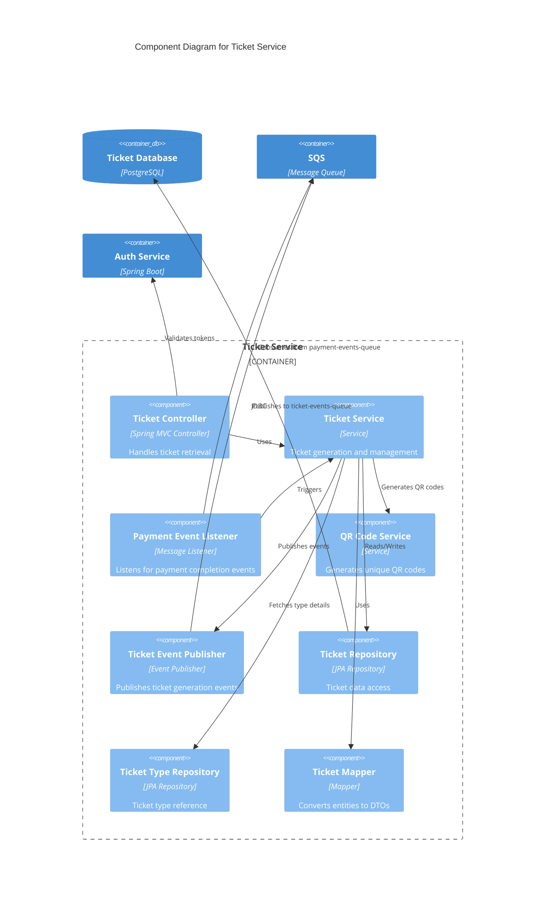
```mermaid
C4Component
    title Component Diagram for Ticket Service

    Container_Boundary(ticketService, "Ticket Service") {
        Component(ticketController, "Ticket Controller", "Spring MVC Controller", "Handles ticket retrieval")
        Component(ticketServiceImpl, "Ticket Service", "Service", "Ticket generation and management")
        Component(paymentEventListener, "Payment Event Listener", "Message Listener", "Listens for payment completion events")
        Component(qrCodeService, "QR Code Service", "Service", "Generates unique QR codes")
        Component(ticketEventPublisher, "Ticket Event Publisher", "Event Publisher", "Publishes ticket generation events")
        Component(ticketRepository, "Ticket Repository", "JPA Repository", "Ticket data access")
        Component(ticketTypeRepository, "Ticket Type Repository", "JPA Repository", "Ticket type reference")
        Component(ticketMapper, "Ticket Mapper", "Mapper", "Converts entities to DTOs")
    }
    
    ContainerDb(ticketDb, "Ticket Database", "PostgreSQL")
    Container(messageQueue, "SQS", "Message Queue")
    Container(authService, "Auth Service", "Spring Boot")
    
    Rel(ticketController, ticketServiceImpl, "Uses")
    Rel(paymentEventListener, messageQueue, "Consumes from payment-events-queue")
    Rel(paymentEventListener, ticketServiceImpl, "Triggers")
    Rel(ticketServiceImpl, qrCodeService, "Generates QR codes")
    Rel(ticketServiceImpl, ticketRepository, "Reads/Writes")
    Rel(ticketServiceImpl, ticketTypeRepository, "Fetches type details")
    Rel(ticketServiceImpl, ticketEventPublisher, "Publishes events")
    Rel(ticketServiceImpl, ticketMapper, "Uses")
    Rel(ticketEventPublisher, messageQueue, "Publishes to ticket-events-queue")
    Rel(ticketRepository, ticketDb, "JDBC")
    Rel(ticketController, authService, "Validates tokens")
```

### Payment Service Components

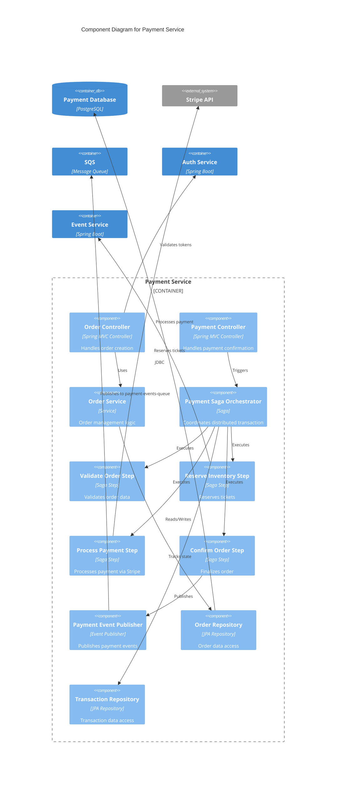
```mermaid
C4Component
    title Component Diagram for Payment Service

    Container_Boundary(paymentService, "Payment Service") {
        Component(orderController, "Order Controller", "Spring MVC Controller", "Handles order creation")
        Component(paymentController, "Payment Controller", "Spring MVC Controller", "Handles payment confirmation")
        Component(orderServiceImpl, "Order Service", "Service", "Order management logic")
        Component(paymentSaga, "Payment Saga Orchestrator", "Saga", "Coordinates distributed transaction")
        Component(validateOrderStep, "Validate Order Step", "Saga Step", "Validates order data")
        Component(reserveInventoryStep, "Reserve Inventory Step", "Saga Step", "Reserves tickets")
        Component(processPaymentStep, "Process Payment Step", "Saga Step", "Processes payment via Stripe")
        Component(confirmOrderStep, "Confirm Order Step", "Saga Step", "Finalizes order")
        Component(paymentEventPublisher, "Payment Event Publisher", "Event Publisher", "Publishes payment events")
        Component(orderRepository, "Order Repository", "JPA Repository", "Order data access")
        Component(transactionRepository, "Transaction Repository", "JPA Repository", "Transaction data access")
    }
    
    ContainerDb(paymentDb, "Payment Database", "PostgreSQL")
    System_Ext(stripe, "Stripe API")
    Container(messageQueue, "SQS", "Message Queue")
    Container(authService, "Auth Service", "Spring Boot")
    Container(eventService, "Event Service", "Spring Boot")
    
    Rel(orderController, orderServiceImpl, "Uses")
    Rel(paymentController, paymentSaga, "Triggers")
    Rel(paymentSaga, validateOrderStep, "Executes")
    Rel(paymentSaga, reserveInventoryStep, "Executes")
    Rel(paymentSaga, processPaymentStep, "Executes")
    Rel(paymentSaga, confirmOrderStep, "Executes")
    Rel(processPaymentStep, stripe, "Processes payment")
    Rel(reserveInventoryStep, eventService, "Reserves tickets")
    Rel(confirmOrderStep, paymentEventPublisher, "Publishes")
    Rel(paymentEventPublisher, messageQueue, "Publishes to payment-events-queue")
    Rel(orderServiceImpl, orderRepository, "Reads/Writes")
    Rel(paymentSaga, transactionRepository, "Tracks state")
    Rel(orderRepository, paymentDb, "JDBC")
    Rel(orderController, authService, "Validates tokens")
```

### Notification Service Components

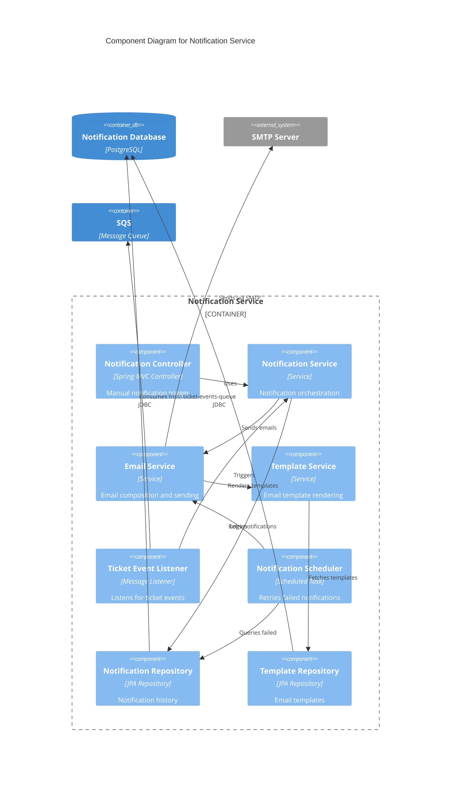
```mermaid
C4Component
    title Component Diagram for Notification Service

    Container_Boundary(notificationService, "Notification Service") {
        Component(notificationController, "Notification Controller", "Spring MVC Controller", "Manual notification trigger")
        Component(notificationServiceImpl, "Notification Service", "Service", "Notification orchestration")
        Component(emailService, "Email Service", "Service", "Email composition and sending")
        Component(templateService, "Template Service", "Service", "Email template rendering")
        Component(ticketEventListener, "Ticket Event Listener", "Message Listener", "Listens for ticket events")
        Component(notificationScheduler, "Notification Scheduler", "Scheduled Task", "Retries failed notifications")
        Component(notificationRepository, "Notification Repository", "JPA Repository", "Notification history")
        Component(templateRepository, "Template Repository", "JPA Repository", "Email templates")
    }
    
    ContainerDb(notificationDb, "Notification Database", "PostgreSQL")
    System_Ext(smtp, "SMTP Server")
    Container(messageQueue, "SQS", "Message Queue")
    
    Rel(notificationController, notificationServiceImpl, "Uses")
    Rel(ticketEventListener, messageQueue, "Consumes from ticket-events-queue")
    Rel(ticketEventListener, notificationServiceImpl, "Triggers")
    Rel(notificationServiceImpl, emailService, "Sends emails")
    Rel(emailService, templateService, "Renders templates")
    Rel(emailService, smtp, "Sends via SMTP")
    Rel(notificationScheduler, notificationRepository, "Queries failed")
    Rel(notificationScheduler, emailService, "Retries")
    Rel(notificationServiceImpl, notificationRepository, "Logs notifications")
    Rel(templateService, templateRepository, "Fetches templates")
    Rel(notificationRepository, notificationDb, "JDBC")
    Rel(templateRepository, notificationDb, "JDBC")
```

---

## Sequence Diagrams

### Requirement 1: User Registration

**User Story:** As a potential user of the ticket booking system, I want to create a new account.

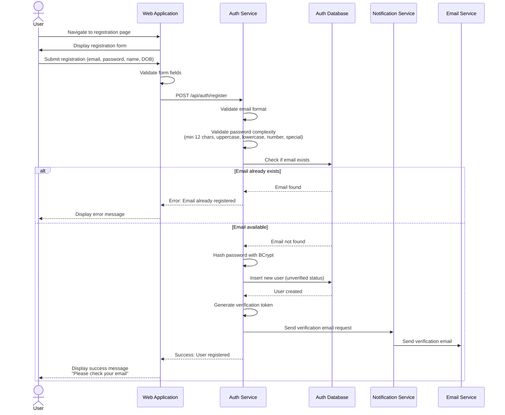
```mermaid
sequenceDiagram
    actor User
    participant WebApp as Web Application
    participant Auth as Auth Service
    participant DB as Auth Database
    participant Notification as Notification Service
    participant SMTP as Email Service

    User->>WebApp: Navigate to registration page
    WebApp->>User: Display registration form
    
    User->>WebApp: Submit registration (email, password, name, DOB)
    WebApp->>WebApp: Validate form fields
    
    WebApp->>Auth: POST /api/auth/register
    Auth->>Auth: Validate email format
    Auth->>Auth: Validate password complexity<br/>(min 12 chars, uppercase, lowercase, number, special)
    Auth->>DB: Check if email exists
    
    alt Email already exists
        DB-->>Auth: Email found
        Auth-->>WebApp: Error: Email already registered
        WebApp-->>User: Display error message
    else Email available
        DB-->>Auth: Email not found
        Auth->>Auth: Hash password with BCrypt
        Auth->>DB: Insert new user (unverified status)
        DB-->>Auth: User created
        Auth->>Auth: Generate verification token
        Auth->>Notification: Send verification email request
        Notification->>SMTP: Send verification email
        Auth-->>WebApp: Success: User registered
        WebApp-->>User: Display success message<br/>"Please check your email"
    end
```

### Requirement 2: Email Verification

**User Story:** As a newly registered user, I want to verify my email address.

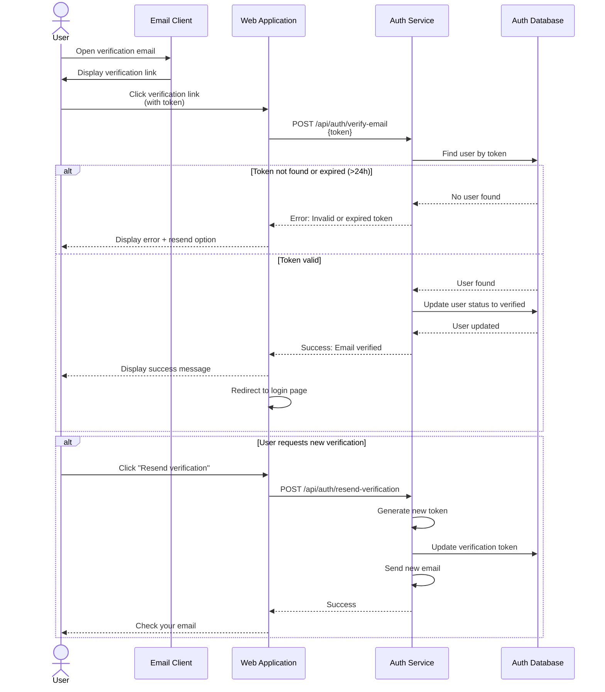
```mermaid
sequenceDiagram
    actor User
    participant Email as Email Client
    participant WebApp as Web Application
    participant Auth as Auth Service
    participant DB as Auth Database

    User->>Email: Open verification email
    Email->>User: Display verification link
    
    User->>WebApp: Click verification link<br/>(with token)
    WebApp->>Auth: POST /api/auth/verify-email<br/>{token}
    
    Auth->>DB: Find user by token
    
    alt Token not found or expired (>24h)
        DB-->>Auth: No user found
        Auth-->>WebApp: Error: Invalid or expired token
        WebApp-->>User: Display error + resend option
    else Token valid
        DB-->>Auth: User found
        Auth->>DB: Update user status to verified
        DB-->>Auth: User updated
        Auth-->>WebApp: Success: Email verified
        WebApp-->>User: Display success message
        WebApp->>WebApp: Redirect to login page
    end
    
    alt User requests new verification
        User->>WebApp: Click "Resend verification"
        WebApp->>Auth: POST /api/auth/resend-verification
        Auth->>Auth: Generate new token
        Auth->>DB: Update verification token
        Auth->>Auth: Send new email
        Auth-->>WebApp: Success
        WebApp-->>User: Check your email
    end
```

### Requirement 3: User Login

**User Story:** As a registered user, I want to log in to my account.

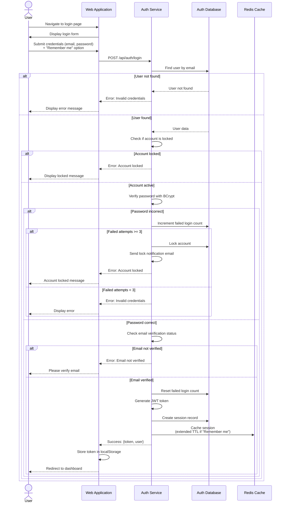
```mermaid
sequenceDiagram
    actor User
    participant WebApp as Web Application
    participant Auth as Auth Service
    participant DB as Auth Database
    participant Redis as Redis Cache

    User->>WebApp: Navigate to login page
    WebApp->>User: Display login form
    
    User->>WebApp: Submit credentials (email, password)<br/>+ "Remember me" option
    WebApp->>Auth: POST /api/auth/login
    
    Auth->>DB: Find user by email
    
    alt User not found
        DB-->>Auth: User not found
        Auth-->>WebApp: Error: Invalid credentials
        WebApp-->>User: Display error message
    else User found
        DB-->>Auth: User data
        
        Auth->>Auth: Check if account is locked
        
        alt Account locked
            Auth-->>WebApp: Error: Account locked
            WebApp-->>User: Display locked message
        else Account active
            Auth->>Auth: Verify password with BCrypt
            
            alt Password incorrect
                Auth->>DB: Increment failed login count
                
                alt Failed attempts >= 3
                    Auth->>DB: Lock account
                    Auth->>Auth: Send lock notification email
                    Auth-->>WebApp: Error: Account locked
                    WebApp-->>User: Account locked message
                else Failed attempts < 3
                    Auth-->>WebApp: Error: Invalid credentials
                    WebApp-->>User: Display error
                end
            else Password correct
                Auth->>Auth: Check email verification status
                
                alt Email not verified
                    Auth-->>WebApp: Error: Email not verified
                    WebApp-->>User: Please verify email
                else Email verified
                    Auth->>DB: Reset failed login count
                    Auth->>Auth: Generate JWT token
                    Auth->>DB: Create session record
                    Auth->>Redis: Cache session<br/>(extended TTL if "Remember me")
                    Auth-->>WebApp: Success: {token, user}
                    WebApp->>WebApp: Store token in localStorage
                    WebApp-->>User: Redirect to dashboard
                end
            end
        end
    end
```

### Requirement 4: Password Reset

**User Story:** As a user who forgot their password, I want to reset my password.

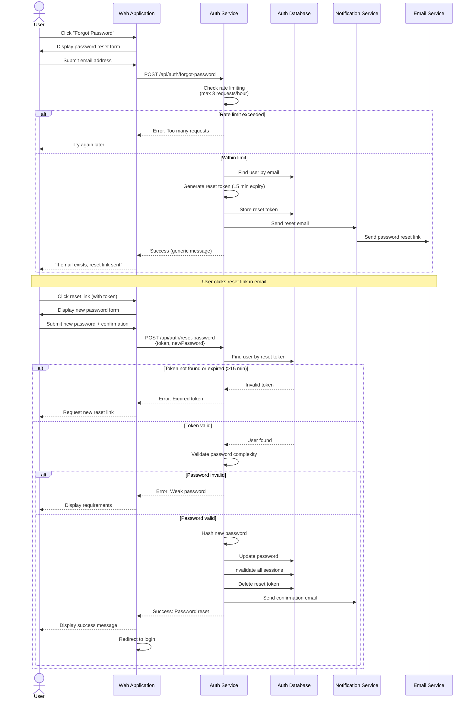
```mermaid
sequenceDiagram
    actor User
    participant WebApp as Web Application
    participant Auth as Auth Service
    participant DB as Auth Database
    participant Notification as Notification Service
    participant SMTP as Email Service

    User->>WebApp: Click "Forgot Password"
    WebApp->>User: Display password reset form
    
    User->>WebApp: Submit email address
    WebApp->>Auth: POST /api/auth/forgot-password
    
    Auth->>Auth: Check rate limiting<br/>(max 3 requests/hour)
    
    alt Rate limit exceeded
        Auth-->>WebApp: Error: Too many requests
        WebApp-->>User: Try again later
    else Within limit
        Auth->>DB: Find user by email
        Auth->>Auth: Generate reset token (15 min expiry)
        Auth->>DB: Store reset token
        Auth->>Notification: Send reset email
        Notification->>SMTP: Send password reset link
        Auth-->>WebApp: Success (generic message)
        WebApp-->>User: "If email exists, reset link sent"
    end
    
    Note over User,SMTP: User clicks reset link in email
    
    User->>WebApp: Click reset link (with token)
    WebApp->>User: Display new password form
    
    User->>WebApp: Submit new password + confirmation
    WebApp->>Auth: POST /api/auth/reset-password<br/>{token, newPassword}
    
    Auth->>DB: Find user by reset token
    
    alt Token not found or expired (>15 min)
        DB-->>Auth: Invalid token
        Auth-->>WebApp: Error: Expired token
        WebApp-->>User: Request new reset link
    else Token valid
        DB-->>Auth: User found
        Auth->>Auth: Validate password complexity
        
        alt Password invalid
            Auth-->>WebApp: Error: Weak password
            WebApp-->>User: Display requirements
        else Password valid
            Auth->>Auth: Hash new password
            Auth->>DB: Update password
            Auth->>DB: Invalidate all sessions
            Auth->>DB: Delete reset token
            Auth->>Notification: Send confirmation email
            Auth-->>WebApp: Success: Password reset
            WebApp-->>User: Display success message
            WebApp->>WebApp: Redirect to login
        end
    end
```

### Requirement 5: Create Event

**User Story:** As an event organizer, I want to create a new event listing.

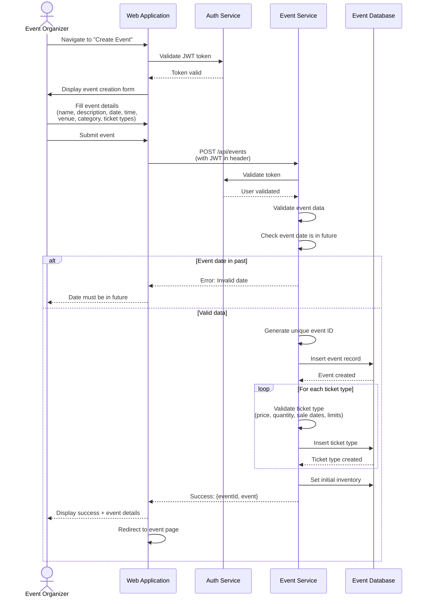
```mermaid
sequenceDiagram
    actor Organizer as Event Organizer
    participant WebApp as Web Application
    participant Auth as Auth Service
    participant Event as Event Service
    participant DB as Event Database

    Organizer->>WebApp: Navigate to "Create Event"
    WebApp->>Auth: Validate JWT token
    Auth-->>WebApp: Token valid
    WebApp->>Organizer: Display event creation form
    
    Organizer->>WebApp: Fill event details<br/>(name, description, date, time,<br/>venue, category, ticket types)
    Organizer->>WebApp: Submit event
    
    WebApp->>Event: POST /api/events<br/>(with JWT in header)
    Event->>Auth: Validate token
    Auth-->>Event: User validated
    
    Event->>Event: Validate event data
    Event->>Event: Check event date is in future
    
    alt Event date in past
        Event-->>WebApp: Error: Invalid date
        WebApp-->>Organizer: Date must be in future
    else Valid data
        Event->>Event: Generate unique event ID
        Event->>DB: Insert event record
        DB-->>Event: Event created
        
        loop For each ticket type
            Event->>Event: Validate ticket type<br/>(price, quantity, sale dates, limits)
            Event->>DB: Insert ticket type
            DB-->>Event: Ticket type created
        end
        
        Event->>DB: Set initial inventory
        Event-->>WebApp: Success: {eventId, event}
        WebApp-->>Organizer: Display success + event details
        WebApp->>WebApp: Redirect to event page
    end
```

### Requirement 6: Search Events

**User Story:** As a user, I want to search for events.

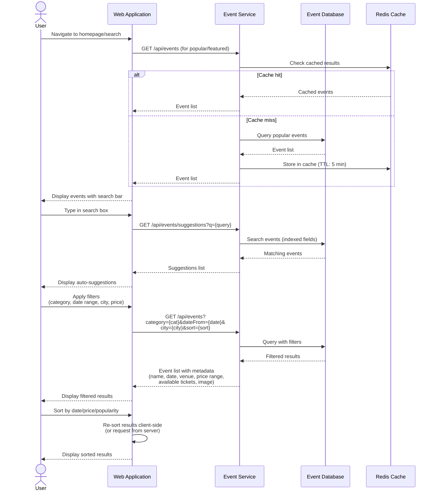
```mermaid
sequenceDiagram
    actor User
    participant WebApp as Web Application
    participant Event as Event Service
    participant DB as Event Database
    participant Cache as Redis Cache

    User->>WebApp: Navigate to homepage/search
    WebApp->>Event: GET /api/events (for popular/featured)
    Event->>Cache: Check cached results
    
    alt Cache hit
        Cache-->>Event: Cached events
        Event-->>WebApp: Event list
    else Cache miss
        Event->>DB: Query popular events
        DB-->>Event: Event list
        Event->>Cache: Store in cache (TTL: 5 min)
        Event-->>WebApp: Event list
    end
    
    WebApp-->>User: Display events with search bar
    
    User->>WebApp: Type in search box
    WebApp->>Event: GET /api/events/suggestions?q={query}
    Event->>DB: Search events (indexed fields)
    DB-->>Event: Matching events
    Event-->>WebApp: Suggestions list
    WebApp-->>User: Display auto-suggestions
    
    User->>WebApp: Apply filters<br/>(category, date range, city, price)
    WebApp->>Event: GET /api/events?<br/>category={cat}&dateFrom={date}&<br/>city={city}&sort={sort}
    
    Event->>DB: Query with filters
    DB-->>Event: Filtered results
    Event-->>WebApp: Event list with metadata<br/>(name, date, venue, price range,<br/>available tickets, image)
    
    WebApp-->>User: Display filtered results
    
    User->>WebApp: Sort by date/price/popularity
    WebApp->>WebApp: Re-sort results client-side<br/>(or request from server)
    WebApp-->>User: Display sorted results
```

### Requirement 7: Select Tickets

**User Story:** As a user, I want to select tickets for purchase.

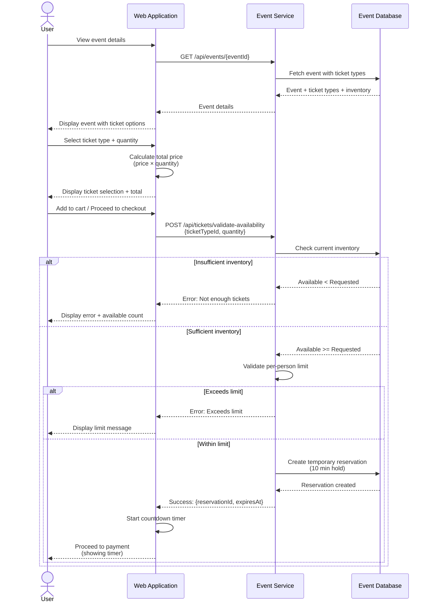
```mermaid
sequenceDiagram
    actor User
    participant WebApp as Web Application
    participant Event as Event Service
    participant DB as Event Database

    User->>WebApp: View event details
    WebApp->>Event: GET /api/events/{eventId}
    Event->>DB: Fetch event with ticket types
    DB-->>Event: Event + ticket types + inventory
    Event-->>WebApp: Event details
    WebApp-->>User: Display event with ticket options
    
    User->>WebApp: Select ticket type + quantity
    WebApp->>WebApp: Calculate total price<br/>(price × quantity)
    WebApp-->>User: Display ticket selection + total
    
    User->>WebApp: Add to cart / Proceed to checkout
    WebApp->>Event: POST /api/tickets/validate-availability<br/>{ticketTypeId, quantity}
    
    Event->>DB: Check current inventory
    
    alt Insufficient inventory
        DB-->>Event: Available < Requested
        Event-->>WebApp: Error: Not enough tickets
        WebApp-->>User: Display error + available count
    else Sufficient inventory
        DB-->>Event: Available >= Requested
        Event->>Event: Validate per-person limit
        
        alt Exceeds limit
            Event-->>WebApp: Error: Exceeds limit
            WebApp-->>User: Display limit message
        else Within limit
            Event->>DB: Create temporary reservation<br/>(10 min hold)
            DB-->>Event: Reservation created
            Event-->>WebApp: Success: {reservationId, expiresAt}
            WebApp->>WebApp: Start countdown timer
            WebApp-->>User: Proceed to payment<br/>(showing timer)
        end
    end
```

### Requirement 8: Payment Processing

**User Story:** As a user, I want to pay for my selected tickets.

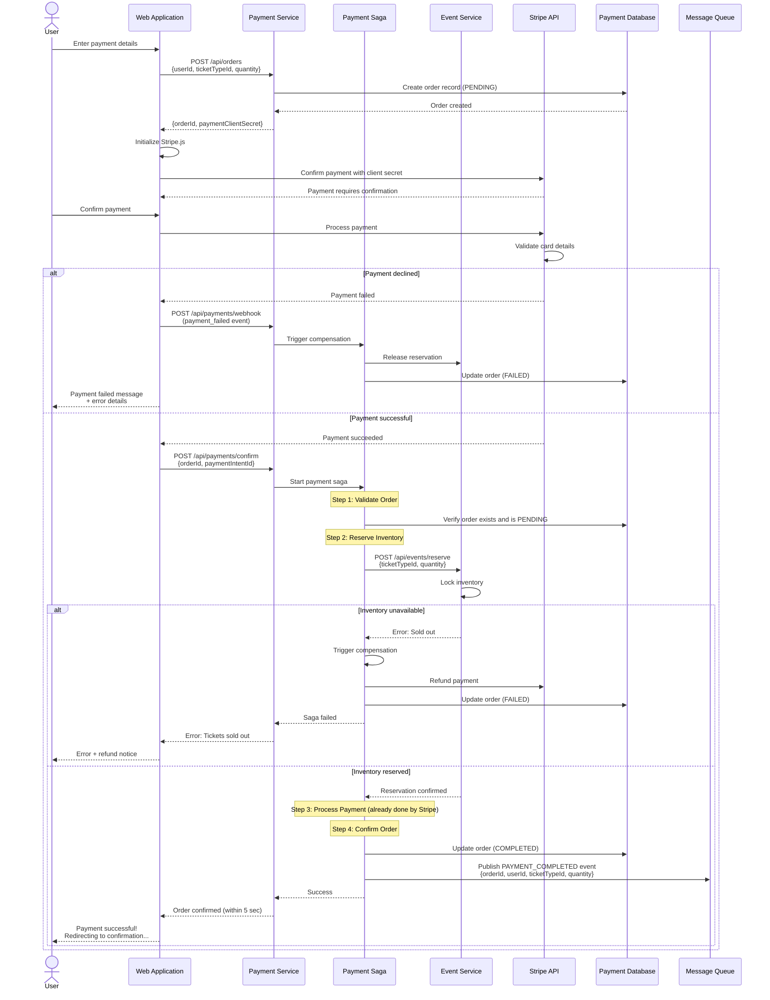
```mermaid
sequenceDiagram
    actor User
    participant WebApp as Web Application
    participant Payment as Payment Service
    participant Saga as Payment Saga
    participant Event as Event Service
    participant Stripe as Stripe API
    participant DB as Payment Database
    participant Queue as Message Queue

    User->>WebApp: Enter payment details
    WebApp->>Payment: POST /api/orders<br/>{userId, ticketTypeId, quantity}
    Payment->>DB: Create order record (PENDING)
    DB-->>Payment: Order created
    Payment-->>WebApp: {orderId, paymentClientSecret}
    
    WebApp->>WebApp: Initialize Stripe.js
    WebApp->>Stripe: Confirm payment with client secret
    Stripe-->>WebApp: Payment requires confirmation
    
    User->>WebApp: Confirm payment
    WebApp->>Stripe: Process payment
    Stripe->>Stripe: Validate card details
    
    alt Payment declined
        Stripe-->>WebApp: Payment failed
        WebApp->>Payment: POST /api/payments/webhook<br/>(payment_failed event)
        Payment->>Saga: Trigger compensation
        Saga->>Event: Release reservation
        Saga->>DB: Update order (FAILED)
        WebApp-->>User: Payment failed message<br/>+ error details
    else Payment successful
        Stripe-->>WebApp: Payment succeeded
        WebApp->>Payment: POST /api/payments/confirm<br/>{orderId, paymentIntentId}
        
        Payment->>Saga: Start payment saga
        
        Note over Saga: Step 1: Validate Order
        Saga->>DB: Verify order exists and is PENDING
        
        Note over Saga: Step 2: Reserve Inventory
        Saga->>Event: POST /api/events/reserve<br/>{ticketTypeId, quantity}
        Event->>Event: Lock inventory
        
        alt Inventory unavailable
            Event-->>Saga: Error: Sold out
            Saga->>Saga: Trigger compensation
            Saga->>Stripe: Refund payment
            Saga->>DB: Update order (FAILED)
            Saga-->>Payment: Saga failed
            Payment-->>WebApp: Error: Tickets sold out
            WebApp-->>User: Error + refund notice
        else Inventory reserved
            Event-->>Saga: Reservation confirmed
            
            Note over Saga: Step 3: Process Payment (already done by Stripe)
            
            Note over Saga: Step 4: Confirm Order
            Saga->>DB: Update order (COMPLETED)
            Saga->>Queue: Publish PAYMENT_COMPLETED event<br/>{orderId, userId, ticketTypeId, quantity}
            Saga-->>Payment: Success
            Payment-->>WebApp: Order confirmed (within 5 sec)
            WebApp-->>User: Payment successful!<br/>Redirecting to confirmation...
        end
    end
```

### Requirement 9: Purchase Confirmation

**User Story:** As a user, I want to receive confirmation of my purchase.

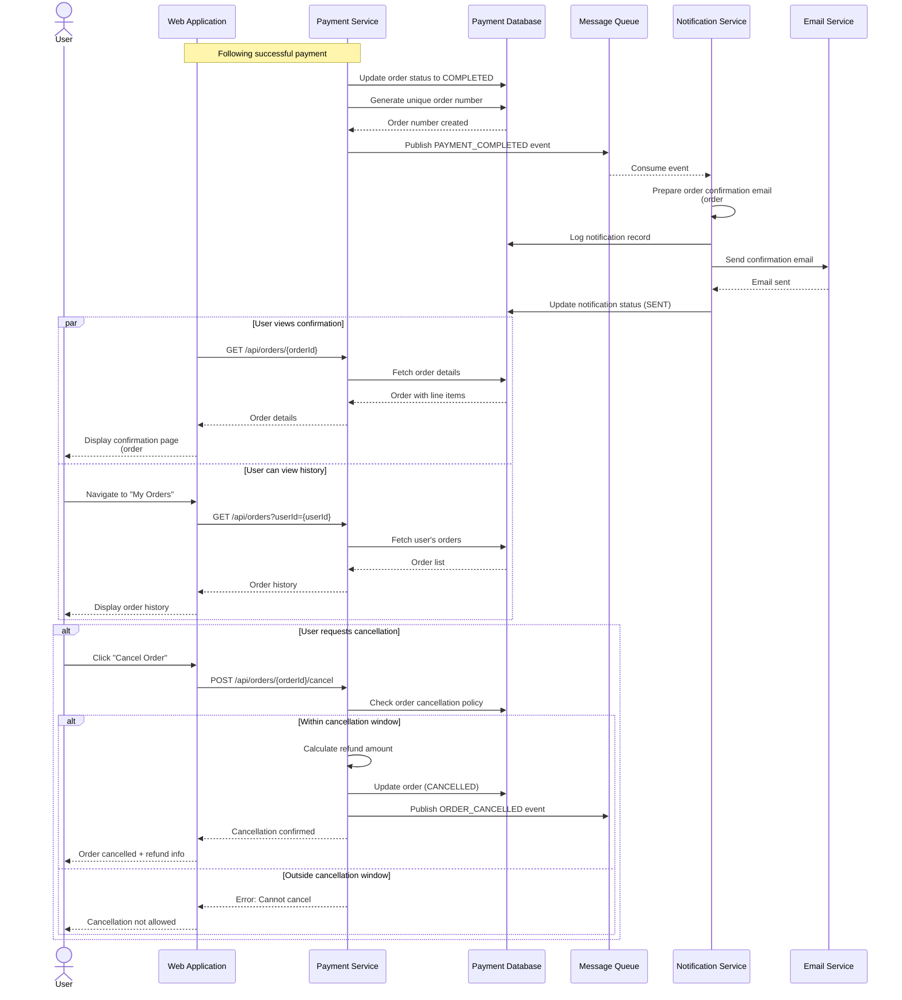
```mermaid
sequenceDiagram
    actor User
    participant WebApp as Web Application
    participant Payment as Payment Service
    participant DB as Payment Database
    participant Queue as Message Queue
    participant Notification as Notification Service
    participant SMTP as Email Service

    Note over WebApp,Payment: Following successful payment
    
    Payment->>DB: Update order status to COMPLETED
    Payment->>DB: Generate unique order number
    DB-->>Payment: Order number created
    
    Payment->>Queue: Publish PAYMENT_COMPLETED event
    Queue-->>Notification: Consume event
    
    Notification->>Notification: Prepare order confirmation email<br/>(order #, items, total, receipt)
    Notification->>DB: Log notification record
    Notification->>SMTP: Send confirmation email
    SMTP-->>Notification: Email sent
    Notification->>DB: Update notification status (SENT)
    
    par User views confirmation
        WebApp->>Payment: GET /api/orders/{orderId}
        Payment->>DB: Fetch order details
        DB-->>Payment: Order with line items
        Payment-->>WebApp: Order details
        WebApp-->>User: Display confirmation page<br/>(order #, items, total, receipt)
    and User can view history
        User->>WebApp: Navigate to "My Orders"
        WebApp->>Payment: GET /api/orders?userId={userId}
        Payment->>DB: Fetch user's orders
        DB-->>Payment: Order list
        Payment-->>WebApp: Order history
        WebApp-->>User: Display order history
    end
    
    alt User requests cancellation
        User->>WebApp: Click "Cancel Order"
        WebApp->>Payment: POST /api/orders/{orderId}/cancel
        Payment->>DB: Check order cancellation policy
        
        alt Within cancellation window
            Payment->>Payment: Calculate refund amount
            Payment->>DB: Update order (CANCELLED)
            Payment->>Queue: Publish ORDER_CANCELLED event
            Payment-->>WebApp: Cancellation confirmed
            WebApp-->>User: Order cancelled + refund info
        else Outside cancellation window
            Payment-->>WebApp: Error: Cannot cancel
            WebApp-->>User: Cancellation not allowed
        end
    end
```

### Requirement 10: Digital Ticket Generation

**User Story:** As a ticket holder, I want to receive my digital ticket.

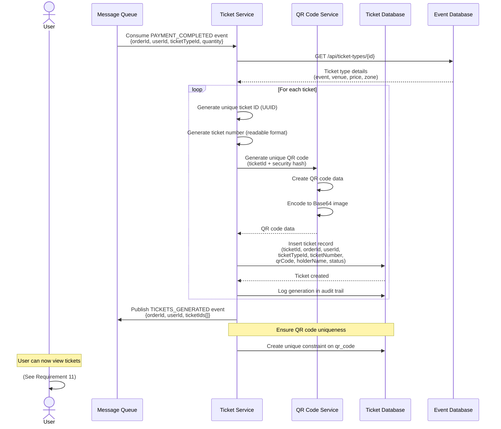
```mermaid
sequenceDiagram
    actor User
    participant Queue as Message Queue
    participant Ticket as Ticket Service
    participant QR as QR Code Service
    participant DB as Ticket Database
    participant EventDB as Event Database

    Queue->>Ticket: Consume PAYMENT_COMPLETED event<br/>{orderId, userId, ticketTypeId, quantity}
    
    Ticket->>EventDB: GET /api/ticket-types/{id}
    EventDB-->>Ticket: Ticket type details<br/>(event, venue, price, zone)
    
    loop For each ticket
        Ticket->>Ticket: Generate unique ticket ID (UUID)
        Ticket->>Ticket: Generate ticket number (readable format)
        
        Ticket->>QR: Generate unique QR code<br/>(ticketId + security hash)
        QR->>QR: Create QR code data
        QR->>QR: Encode to Base64 image
        QR-->>Ticket: QR code data
        
        Ticket->>DB: Insert ticket record<br/>(ticketId, orderId, userId,<br/>ticketTypeId, ticketNumber,<br/>qrCode, holderName, status)
        DB-->>Ticket: Ticket created
        
        Ticket->>DB: Log generation in audit trail
    end
    
    Ticket->>Queue: Publish TICKETS_GENERATED event<br/>{orderId, userId, ticketIds[]}
    
    Note over Ticket,DB: Ensure QR code uniqueness
    Ticket->>DB: Create unique constraint on qr_code
    
    Note over User: User can now view tickets
    User->>User: (See Requirement 11)
```

### Requirement 11: Ticket Delivery

**User Story:** As a ticket holder, I want to receive my ticket through my preferred channel.

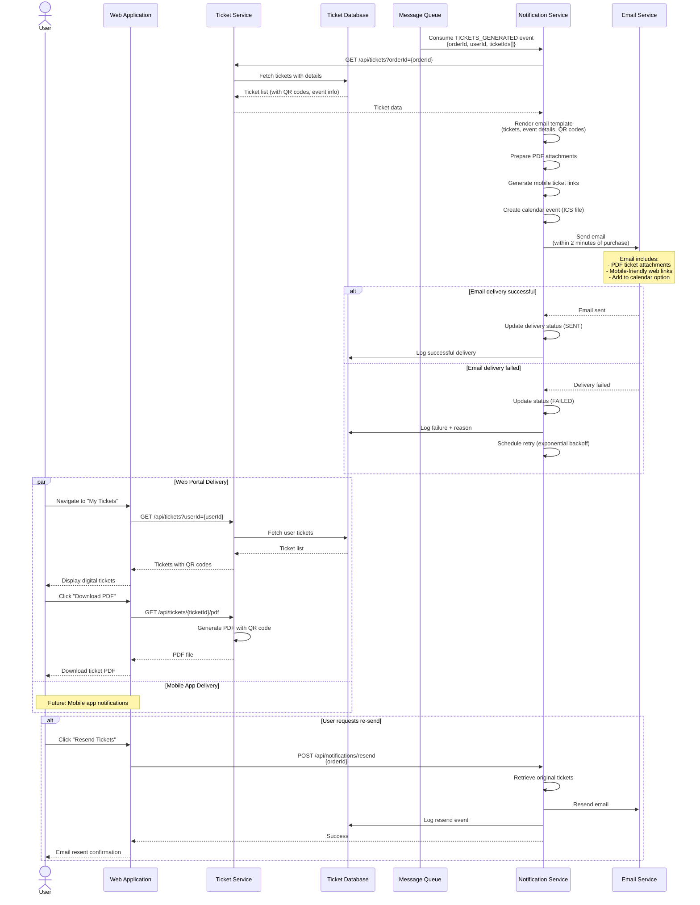
```mermaid
sequenceDiagram
    actor User
    participant WebApp as Web Application
    participant Ticket as Ticket Service
    participant DB as Ticket Database
    participant Queue as Message Queue
    participant Notification as Notification Service
    participant SMTP as Email Service

    Queue->>Notification: Consume TICKETS_GENERATED event<br/>{orderId, userId, ticketIds[]}
    
    Notification->>Ticket: GET /api/tickets?orderId={orderId}
    Ticket->>DB: Fetch tickets with details
    DB-->>Ticket: Ticket list (with QR codes, event info)
    Ticket-->>Notification: Ticket data
    
    Notification->>Notification: Render email template<br/>(tickets, event details, QR codes)
    Notification->>Notification: Prepare PDF attachments
    Notification->>Notification: Generate mobile ticket links
    Notification->>Notification: Create calendar event (ICS file)
    
    Notification->>SMTP: Send email<br/>(within 2 minutes of purchase)
    Note over SMTP: Email includes:<br/>- PDF ticket attachments<br/>- Mobile-friendly web links<br/>- Add to calendar option
    
    alt Email delivery successful
        SMTP-->>Notification: Email sent
        Notification->>Notification: Update delivery status (SENT)
        Notification->>DB: Log successful delivery
    else Email delivery failed
        SMTP-->>Notification: Delivery failed
        Notification->>Notification: Update status (FAILED)
        Notification->>DB: Log failure + reason
        Notification->>Notification: Schedule retry (exponential backoff)
    end
    
    par Web Portal Delivery
        User->>WebApp: Navigate to "My Tickets"
        WebApp->>Ticket: GET /api/tickets?userId={userId}
        Ticket->>DB: Fetch user tickets
        DB-->>Ticket: Ticket list
        Ticket-->>WebApp: Tickets with QR codes
        WebApp-->>User: Display digital tickets
        
        User->>WebApp: Click "Download PDF"
        WebApp->>Ticket: GET /api/tickets/{ticketId}/pdf
        Ticket->>Ticket: Generate PDF with QR code
        Ticket-->>WebApp: PDF file
        WebApp-->>User: Download ticket PDF
    and Mobile App Delivery
        Note over User,WebApp: Future: Mobile app notifications
    end
    
    alt User requests re-send
        User->>WebApp: Click "Resend Tickets"
        WebApp->>Notification: POST /api/notifications/resend<br/>{orderId}
        Notification->>Notification: Retrieve original tickets
        Notification->>SMTP: Resend email
        Notification->>DB: Log resend event
        Notification-->>WebApp: Success
        WebApp-->>User: Email resent confirmation
    end
```

### Requirement 12: Email Notifications

**User Story:** As a user, I want to receive email notifications for important actions.

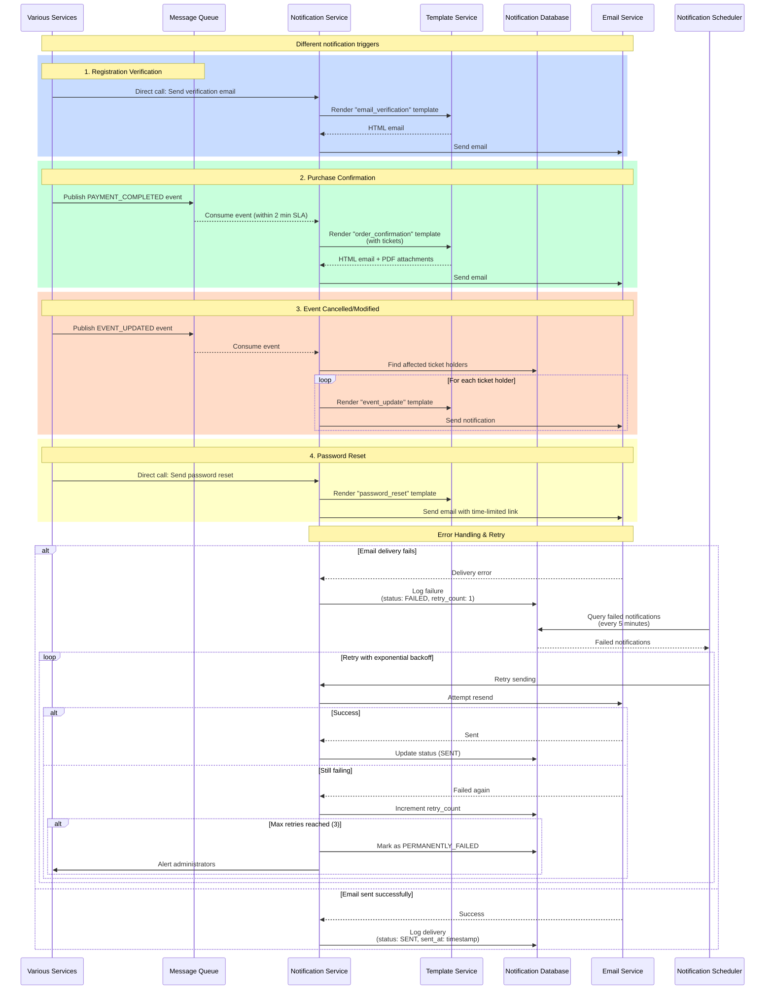
```mermaid
sequenceDiagram
    participant System as Various Services
    participant Queue as Message Queue
    participant Notification as Notification Service
    participant Template as Template Service
    participant DB as Notification Database
    participant SMTP as Email Service
    participant Scheduler as Notification Scheduler

    Note over System,SMTP: Different notification triggers
    
    rect rgb(200, 220, 255)
        Note over System,Queue: 1. Registration Verification
        System->>Notification: Direct call: Send verification email
        Notification->>Template: Render "email_verification" template
        Template-->>Notification: HTML email
        Notification->>SMTP: Send email
    end
    
    rect rgb(200, 255, 220)
        Note over System,SMTP: 2. Purchase Confirmation
        System->>Queue: Publish PAYMENT_COMPLETED event
        Queue-->>Notification: Consume event (within 2 min SLA)
        Notification->>Template: Render "order_confirmation" template<br/>(with tickets)
        Template-->>Notification: HTML email + PDF attachments
        Notification->>SMTP: Send email
    end
    
    rect rgb(255, 220, 200)
        Note over System,SMTP: 3. Event Cancelled/Modified
        System->>Queue: Publish EVENT_UPDATED event
        Queue-->>Notification: Consume event
        Notification->>DB: Find affected ticket holders
        loop For each ticket holder
            Notification->>Template: Render "event_update" template
            Notification->>SMTP: Send notification
        end
    end
    
    rect rgb(255, 255, 200)
        Note over System,SMTP: 4. Password Reset
        System->>Notification: Direct call: Send password reset
        Notification->>Template: Render "password_reset" template
        Notification->>SMTP: Send email with time-limited link
    end
    
    Note over Notification,SMTP: Error Handling & Retry
    
    alt Email delivery fails
        SMTP-->>Notification: Delivery error
        Notification->>DB: Log failure<br/>(status: FAILED, retry_count: 1)
        
        Scheduler->>DB: Query failed notifications<br/>(every 5 minutes)
        DB-->>Scheduler: Failed notifications
        
        loop Retry with exponential backoff
            Scheduler->>Notification: Retry sending
            Notification->>SMTP: Attempt resend
            
            alt Success
                SMTP-->>Notification: Sent
                Notification->>DB: Update status (SENT)
            else Still failing
                SMTP-->>Notification: Failed again
                Notification->>DB: Increment retry_count
                
                alt Max retries reached (3)
                    Notification->>DB: Mark as PERMANENTLY_FAILED
                    Notification->>System: Alert administrators
                end
            end
        end
    else Email sent successfully
        SMTP-->>Notification: Success
        Notification->>DB: Log delivery<br/>(status: SENT, sent_at: timestamp)
    end
```

### Requirement 13: Security & Data Protection

**User Story:** As a user, I want the system to be secure and protect my data.

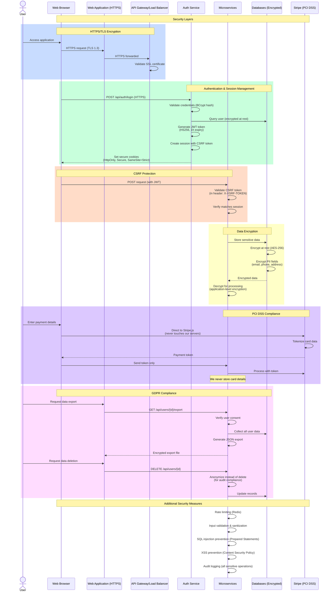
```mermaid
sequenceDiagram
    actor User
    participant Browser as Web Browser
    participant WebApp as Web Application (HTTPS)
    participant Gateway as API Gateway/Load Balancer
    participant Auth as Auth Service
    participant Services as Microservices
    participant DB as Databases (Encrypted)
    participant Stripe as Stripe (PCI DSS)

    Note over Browser,Stripe: Security Layers
    
    rect rgb(200, 220, 255)
        Note over Browser,Gateway: HTTPS/TLS Encryption
        User->>Browser: Access application
        Browser->>WebApp: HTTPS request (TLS 1.3)
        WebApp->>Gateway: HTTPS forwarded
        Gateway->>Gateway: Validate SSL certificate
    end
    
    rect rgb(200, 255, 220)
        Note over Auth,DB: Authentication & Session Management
        Browser->>Auth: POST /api/auth/login (HTTPS)
        Auth->>Auth: Validate credentials (BCrypt hash)
        Auth->>DB: Query user (encrypted at rest)
        Auth->>Auth: Generate JWT token<br/>(HS256, 1h expiry)
        Auth->>Auth: Create session with CSRF token
        Auth-->>Browser: Set secure cookies<br/>(HttpOnly, Secure, SameSite=Strict)
    end
    
    rect rgb(255, 220, 200)
        Note over Browser,Services: CSRF Protection
        Browser->>Services: POST request (with JWT)
        Services->>Services: Validate CSRF token<br/>(in header: X-XSRF-TOKEN)
        Services->>Services: Verify matches session
    end
    
    rect rgb(255, 255, 200)
        Note over Services,DB: Data Encryption
        Services->>DB: Store sensitive data
        DB->>DB: Encrypt at rest (AES-256)
        DB->>DB: Encrypt PII fields<br/>(email, phone, address)
        DB-->>Services: Encrypted data
        Services->>Services: Decrypt for processing<br/>(application-level encryption)
    end
    
    rect rgb(220, 200, 255)
        Note over Services,Stripe: PCI DSS Compliance
        User->>Browser: Enter payment details
        Browser->>Stripe: Direct to Stripe.js<br/>(never touches our servers)
        Stripe->>Stripe: Tokenize card data
        Stripe-->>Browser: Payment token
        Browser->>Services: Send token only
        Services->>Stripe: Process with token
        Note over Services: We never store card details
    end
    
    rect rgb(255, 220, 255)
        Note over Browser,DB: GDPR Compliance
        User->>WebApp: Request data export
        WebApp->>Services: GET /api/users/{id}/export
        Services->>Services: Verify user consent
        Services->>DB: Collect all user data
        Services->>Services: Generate JSON export
        Services-->>WebApp: Encrypted export file
        
        User->>WebApp: Request data deletion
        WebApp->>Services: DELETE /api/users/{id}
        Services->>Services: Anonymize instead of delete<br/>(for audit compliance)
        Services->>DB: Update records
    end
    
    Note over Browser,Stripe: Additional Security Measures
    Services->>Services: Rate limiting (Redis)
    Services->>Services: Input validation & sanitization
    Services->>Services: SQL injection prevention (Prepared Statements)
    Services->>Services: XSS prevention (Content Security Policy)
    Services->>Services: Audit logging (all sensitive operations)
```

### Requirement 14: Performance Under Load

**User Story:** As a user, I want the system to perform well under load.

```mermaid
sequenceDiagram
    actor Users as 1000+ Concurrent Users
    participant LB as Load Balancer
    participant WebApp as Web Apps (Scaled)
    participant Cache as Redis Cache
    participant Services as Services (Auto-scaled)
    participant DB as Database (Read Replicas)
    participant Queue as Message Queue (SQS)
    participant Monitor as CloudWatch/Monitoring

    Note over Users,Monitor: High Traffic Scenario
    
    par Concurrent Requests
        Users->>LB: 1000+ simultaneous requests
        LB->>LB: Distribute load (Round Robin)
        
        loop For each request
            LB->>WebApp: Forward request
            WebApp->>Monitor: Log request metrics
        end
    end
    
    rect rgb(200, 220, 255)
        Note over Cache,Services: Caching Strategy (Response < 3 sec)
        WebApp->>Cache: Check for cached data
        
        alt Cache hit (Hot data)
            Cache-->>WebApp: Return cached result
            WebApp-->>Users: Response (< 100ms)
        else Cache miss
            WebApp->>Services: API request
            Services->>DB: Query database
            DB-->>Services: Data
            Services->>Cache: Store in cache (TTL: 5 min)
            Services-->>WebApp: Response
            WebApp-->>Users: Response (< 3 sec under normal load)
        end
    end
    
    rect rgb(200, 255, 220)
        Note over Services,DB: Database Optimization
        Services->>DB: Read-heavy query
        DB->>DB: Route to read replica
        DB->>DB: Use indexed queries
        DB-->>Services: Results (optimized)
        
        Services->>DB: Write operation
        DB->>DB: Route to primary
        DB->>DB: Async replication to replicas
    end
    
    rect rgb(255, 220, 200)
        Note over Services,Queue: Asynchronous Processing
        Services->>Queue: Publish event (non-blocking)
        Queue-->>Services: Acknowledgment (< 100ms)
        Services-->>WebApp: Immediate response
        
        Note over Queue: Background processing
        Queue->>Services: Deliver to consumers
        Services->>Services: Process asynchronously
    end
    
    rect rgb(255, 255, 200)
        Note over Services,Monitor: Payment Processing (< 10 sec SLA)
        Users->>Services: Initiate payment
        Services->>Services: Start saga (timeout: 10 sec)
        
        par Saga steps with timeouts
            Services->>Services: Validate (timeout: 2 sec)
        and
            Services->>Services: Reserve inventory (timeout: 2 sec)
        and
            Services->>Services: Process payment (timeout: 5 sec)
        end
        
        Services-->>Users: Confirmation (total < 10 sec)
    end
    
    rect rgb(220, 200, 255)
        Note over Services,Monitor: Auto-scaling
        Monitor->>Monitor: Check CPU > 70%
        Monitor->>Services: Trigger scale-up
        Services->>Services: Spin up new instances
        LB->>LB: Add new instances to pool
        
        Monitor->>Monitor: Check CPU < 30%
        Monitor->>Services: Trigger scale-down
        Services->>Services: Graceful shutdown
        LB->>LB: Remove instances from pool
    end
    
    rect rgb(255, 220, 255)
        Note over Services,Monitor: Inventory Consistency
        par Concurrent ticket purchases
            Users->>Services: 100 users buy same ticket
            Services->>DB: SELECT ... FOR UPDATE<br/>(pessimistic locking)
            DB->>DB: Lock inventory row
            Services->>Services: Validate availability
            Services->>DB: Decrement inventory (if available)
            DB->>DB: Release lock
        end
        
        Note over Services,DB: Prevents overselling
    end
    
    Note over Users,Monitor: System maintains 99.9% availability<br/>during high traffic periods
    Monitor->>Monitor: Track uptime metrics
    Monitor->>Monitor: Alert on degradation
    Monitor->>Monitor: Log all performance metrics
```

---

## Summary

This architecture documentation provides:

1. **C4 Context Diagram**: Shows the system's place in the world
2. **C4 Container Diagram**: Shows the major technology components
3. **Component Diagrams**: Detailed view of each microservice's internal structure
4. **Sequence Diagrams**: Flow of interactions for all 14 functional requirements

The system follows a microservices architecture with:
- **5 core services**: Auth, Event, Ticket, Payment, Notification
- **Asynchronous messaging**: Using AWS SQS for event-driven communication
- **Database per service**: PostgreSQL for each microservice
- **Caching layer**: Redis for performance optimization
- **External integrations**: Stripe for payments, SMTP for emails
- **Saga pattern**: For distributed transaction management in payment flow

This architecture ensures scalability, maintainability, and resilience while meeting all functional and non-functional requirements.
