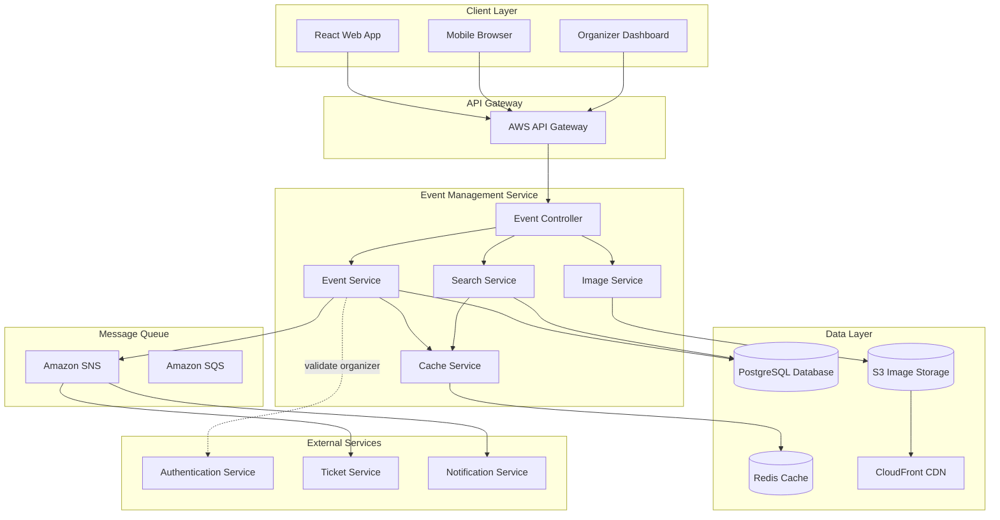
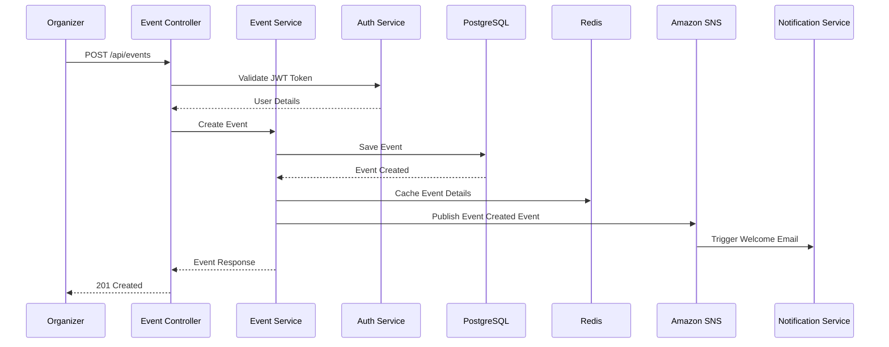
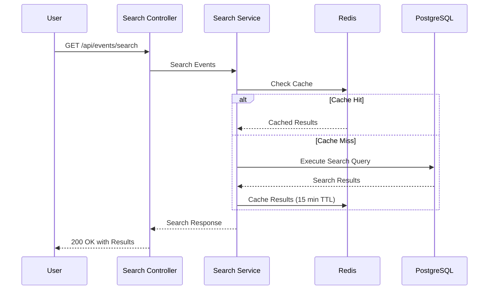
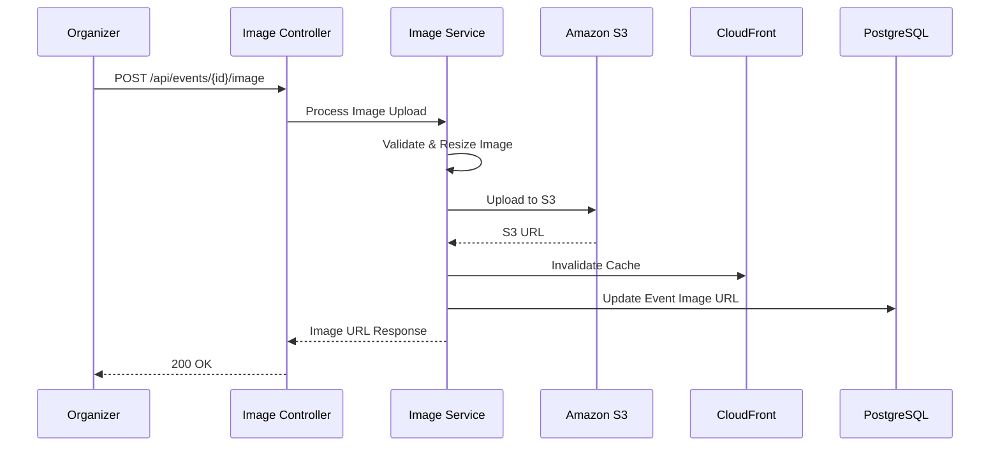

# Event Management Service - Detailed Design Document

## Overview

The Event Management Service is a core microservice in the Event Ticket Booking System MVP that handles all event-related operations including creation, management, search, and discovery. This service enables event organizers to create and manage their events while providing users with powerful search and filtering capabilities to discover events of interest.

## Service Architecture

### High-Level Architecture



### Component Architecture

#### Controller Layer
- **EventController**: REST API endpoints for event operations
- **SearchController**: Specialized endpoints for search and filtering
- **ImageController**: Image upload and management endpoints
- **CategoryController**: Event category management

#### Service Layer
- **EventService**: Core business logic for event management
- **SearchService**: Advanced search and filtering logic
- **ImageService**: Image processing and storage management
- **CategoryService**: Event categorization logic
- **CacheService**: Redis caching abstraction

#### Repository Layer
- **EventRepository**: Event data access operations
- **CategoryRepository**: Category data access
- **VenueRepository**: Venue information management
- **SearchRepository**: Optimized search queries

## Data Models

### Core Entities

#### Event Entity
```java
@Entity
@Table(name = "events")
public class Event {
    @Id
    @GeneratedValue(strategy = GenerationType.UUID)
    private UUID id;
    
    @Column(name = "organizer_id", nullable = false)
    private UUID organizerId; // Reference to Auth Service
    
    @Column(nullable = false, length = 255)
    private String name;
    
    @Column(columnDefinition = "TEXT")
    private String description;
    
    @Column(name = "event_date", nullable = false)
    private LocalDateTime eventDate;
    
    @ManyToOne(fetch = FetchType.LAZY)
    @JoinColumn(name = "venue_id")
    private Venue venue;
    
    @ManyToOne(fetch = FetchType.LAZY)
    @JoinColumn(name = "category_id")
    private EventCategory category;
    
    @Column(name = "image_url", length = 500)
    private String imageUrl;
    
    @Enumerated(EnumType.STRING)
    @Column(length = 50)
    private EventStatus status = EventStatus.DRAFT;
    
    @Column(name = "max_capacity")
    private Integer maxCapacity;
    
    @Column(name = "min_price")
    private BigDecimal minPrice;
    
    @Column(name = "max_price")
    private BigDecimal maxPrice;
    
    @Column(name = "tags")
    private String tags; // JSON array of tags
    
    @CreationTimestamp
    @Column(name = "created_at")
    private LocalDateTime createdAt;
    
    @UpdateTimestamp
    @Column(name = "updated_at")
    private LocalDateTime updatedAt;
    
    // Getters, setters, constructors
}
```

#### EventCategory Entity
```java
@Entity
@Table(name = "event_categories")
public class EventCategory {
    @Id
    @GeneratedValue(strategy = GenerationType.UUID)
    private UUID id;
    
    @Column(unique = true, nullable = false, length = 100)
    private String name;
    
    @Column(columnDefinition = "TEXT")
    private String description;
    
    @Column(name = "icon_url", length = 500)
    private String iconUrl;
    
    @Column(name = "display_order")
    private Integer displayOrder;
    
    @Column(name = "is_active")
    private Boolean isActive = true;
    
    @CreationTimestamp
    @Column(name = "created_at")
    private LocalDateTime createdAt;
    
    // Getters, setters, constructors
}
```

#### Venue Entity
```java
@Entity
@Table(name = "venues")
public class Venue {
    @Id
    @GeneratedValue(strategy = GenerationType.UUID)
    private UUID id;
    
    @Column(nullable = false, length = 255)
    private String name;
    
    @Column(columnDefinition = "TEXT")
    private String address;
    
    @Column(length = 100)
    private String city;
    
    @Column(length = 100)
    private String state;
    
    @Column(length = 20)
    private String zipCode;
    
    @Column(length = 100)
    private String country;
    
    @Column(precision = 10, scale = 8)
    private BigDecimal latitude;
    
    @Column(precision = 11, scale = 8)
    private BigDecimal longitude;
    
    @Column(name = "max_capacity")
    private Integer maxCapacity;
    
    @Column(name = "venue_type", length = 50)
    private String venueType;
    
    @CreationTimestamp
    @Column(name = "created_at")
    private LocalDateTime createdAt;
    
    // Getters, setters, constructors
}
```

### Enums

#### EventStatus
```java
public enum EventStatus {
    DRAFT,
    PUBLISHED,
    CANCELLED,
    POSTPONED,
    COMPLETED
}
```

### Database Schema

```sql
-- Events table with optimized indexes
CREATE TABLE events (
    id UUID PRIMARY KEY DEFAULT gen_random_uuid(),
    organizer_id UUID NOT NULL,
    name VARCHAR(255) NOT NULL,
    description TEXT,
    event_date TIMESTAMP NOT NULL,
    venue_id UUID REFERENCES venues(id),
    category_id UUID REFERENCES event_categories(id),
    image_url VARCHAR(500),
    status VARCHAR(50) DEFAULT 'DRAFT',
    max_capacity INTEGER,
    min_price DECIMAL(10,2),
    max_price DECIMAL(10,2),
    tags TEXT, -- JSON array
    created_at TIMESTAMP DEFAULT CURRENT_TIMESTAMP,
    updated_at TIMESTAMP DEFAULT CURRENT_TIMESTAMP
);

-- Optimized indexes for search performance
CREATE INDEX idx_events_organizer_id ON events(organizer_id);
CREATE INDEX idx_events_event_date ON events(event_date);
CREATE INDEX idx_events_status ON events(status);
CREATE INDEX idx_events_category_id ON events(category_id);
CREATE INDEX idx_events_venue_city ON events USING GIN ((venue.city));
CREATE INDEX idx_events_search_text ON events USING GIN (to_tsvector('english', name || ' ' || description));
CREATE INDEX idx_events_price_range ON events(min_price, max_price);

-- Event categories table
CREATE TABLE event_categories (
    id UUID PRIMARY KEY DEFAULT gen_random_uuid(),
    name VARCHAR(100) UNIQUE NOT NULL,
    description TEXT,
    icon_url VARCHAR(500),
    display_order INTEGER,
    is_active BOOLEAN DEFAULT TRUE,
    created_at TIMESTAMP DEFAULT CURRENT_TIMESTAMP
);

-- Venues table with geospatial support
CREATE TABLE venues (
    id UUID PRIMARY KEY DEFAULT gen_random_uuid(),
    name VARCHAR(255) NOT NULL,
    address TEXT,
    city VARCHAR(100),
    state VARCHAR(100),
    zip_code VARCHAR(20),
    country VARCHAR(100),
    latitude DECIMAL(10,8),
    longitude DECIMAL(11,8),
    max_capacity INTEGER,
    venue_type VARCHAR(50),
    created_at TIMESTAMP DEFAULT CURRENT_TIMESTAMP
);

-- Geospatial index for location-based searches
CREATE INDEX idx_venues_location ON venues USING GIST (point(longitude, latitude));
CREATE INDEX idx_venues_city ON venues(city);
```

## API Specifications

### REST Endpoints

#### Event Management Endpoints

**Create Event**
```http
POST /api/events
Authorization: Bearer {jwt_token}
Content-Type: application/json

{
  "name": "Summer Music Festival",
  "description": "Annual outdoor music festival featuring top artists",
  "eventDate": "2024-07-15T18:00:00Z",
  "venue": {
    "name": "Central Park",
    "address": "Central Park, New York, NY",
    "city": "New York",
    "state": "NY",
    "zipCode": "10024",
    "country": "USA"
  },
  "categoryId": "550e8400-e29b-41d4-a716-446655440000",
  "maxCapacity": 5000,
  "tags": ["music", "outdoor", "festival"]
}
```

**Response:**
```json
{
  "success": true,
  "data": {
    "id": "123e4567-e89b-12d3-a456-426614174000",
    "name": "Summer Music Festival",
    "description": "Annual outdoor music festival featuring top artists",
    "eventDate": "2024-07-15T18:00:00Z",
    "venue": {
      "id": "456e7890-e89b-12d3-a456-426614174001",
      "name": "Central Park",
      "address": "Central Park, New York, NY",
      "city": "New York",
      "state": "NY"
    },
    "category": {
      "id": "550e8400-e29b-41d4-a716-446655440000",
      "name": "Music"
    },
    "status": "DRAFT",
    "createdAt": "2024-01-15T10:30:00Z"
  }
}
```

**Get Event Details**
```http
GET /api/events/{eventId}
```

**Update Event**
```http
PUT /api/events/{eventId}
Authorization: Bearer {jwt_token}
Content-Type: application/json
```

**Delete Event**
```http
DELETE /api/events/{eventId}
Authorization: Bearer {jwt_token}
```

#### Search Endpoints

**Search Events**
```http
GET /api/events/search?query=music&city=New York&category=music&dateFrom=2024-01-01&dateTo=2024-12-31&minPrice=50&maxPrice=200&page=0&size=20&sort=date,asc
```

**Response:**
```json
{
  "success": true,
  "data": {
    "content": [
      {
        "id": "123e4567-e89b-12d3-a456-426614174000",
        "name": "Summer Music Festival",
        "eventDate": "2024-07-15T18:00:00Z",
        "venue": {
          "name": "Central Park",
          "city": "New York"
        },
        "category": {
          "name": "Music"
        },
        "minPrice": 75.00,
        "maxPrice": 150.00,
        "imageUrl": "https://cdn.example.com/events/123.jpg",
        "availableTickets": 1250
      }
    ],
    "pageable": {
      "page": 0,
      "size": 20,
      "totalElements": 45,
      "totalPages": 3
    }
  }
}
```

**Search Suggestions**
```http
GET /api/events/suggestions?query=mus
```

**Response:**
```json
{
  "success": true,
  "data": {
    "events": ["Music Festival", "Musical Theater"],
    "venues": ["Music Hall", "Museum of Arts"],
    "categories": ["Music"],
    "cities": ["Music City"]
  }
}
```

#### Category Management

**Get Categories**
```http
GET /api/categories
```

**Create Category** (Admin only)
```http
POST /api/categories
Authorization: Bearer {admin_jwt_token}
```

#### Image Management

**Upload Event Image**
```http
POST /api/events/{eventId}/image
Authorization: Bearer {jwt_token}
Content-Type: multipart/form-data

file: [image_file]
```

## Data Flow Diagrams

### Event Creation Flow



### Event Search Flow



### Image Upload Flow



## Integration Patterns

### Authentication Service Integration

**User Validation Pattern**
```java
@Service
public class EventService {
    
    @Autowired
    private AuthServiceClient authServiceClient;
    
    public EventDto createEvent(CreateEventRequest request, String jwtToken) {
        // Validate organizer permissions
        UserDto organizer = authServiceClient.validateToken(jwtToken);
        if (!organizer.hasRole("ORGANIZER")) {
            throw new ForbiddenException("User not authorized to create events");
        }
        
        // Create event logic
        Event event = new Event();
        event.setOrganizerId(organizer.getId());
        // ... set other properties
        
        return eventRepository.save(event);
    }
}
```

### Ticket Service Integration

**Event Details Sharing Pattern**
```java
@RestController
public class EventController {
    
    // Internal API for other services
    @GetMapping("/internal/events/{eventId}")
    public EventDetailsDto getEventForTicketService(@PathVariable UUID eventId) {
        Event event = eventService.findById(eventId);
        return EventDetailsDto.builder()
            .id(event.getId())
            .name(event.getName())
            .eventDate(event.getEventDate())
            .venue(event.getVenue())
            .maxCapacity(event.getMaxCapacity())
            .build();
    }
}
```

### Notification Service Integration

**Event Lifecycle Events**
```java
@Service
public class EventService {
    
    @Autowired
    private SnsPublisher snsPublisher;
    
    public void publishEvent(Event event) {
        event.setStatus(EventStatus.PUBLISHED);
        eventRepository.save(event);
        
        // Publish event to SNS
        EventPublishedEvent eventData = EventPublishedEvent.builder()
            .eventId(event.getId())
            .eventName(event.getName())
            .eventDate(event.getEventDate())
            .organizerId(event.getOrganizerId())
            .build();
            
        snsPublisher.publish("event-published", eventData);
    }
}
```

## Caching Strategy

### Redis Caching Implementation

#### Event Details Caching
```java
@Service
public class CacheService {
    
    @Autowired
    private RedisTemplate<String, Object> redisTemplate;
    
    private static final String EVENT_CACHE_KEY = "event:";
    private static final Duration EVENT_CACHE_TTL = Duration.ofHours(1);
    
    public void cacheEvent(Event event) {
        String key = EVENT_CACHE_KEY + event.getId();
        redisTemplate.opsForValue().set(key, event, EVENT_CACHE_TTL);
    }
    
    public Optional<Event> getCachedEvent(UUID eventId) {
        String key = EVENT_CACHE_KEY + eventId;
        Event event = (Event) redisTemplate.opsForValue().get(key);
        return Optional.ofNullable(event);
    }
}
```

#### Search Results Caching
```java
@Service
public class SearchService {
    
    private static final String SEARCH_CACHE_KEY = "search:";
    private static final Duration SEARCH_CACHE_TTL = Duration.ofMinutes(15);
    
    public Page<EventSummaryDto> searchEvents(SearchCriteria criteria) {
        String cacheKey = generateCacheKey(criteria);
        
        // Check cache first
        Page<EventSummaryDto> cachedResults = getCachedSearchResults(cacheKey);
        if (cachedResults != null) {
            return cachedResults;
        }
        
        // Execute search query
        Page<EventSummaryDto> results = executeSearchQuery(criteria);
        
        // Cache results
        cacheSearchResults(cacheKey, results);
        
        return results;
    }
    
    private String generateCacheKey(SearchCriteria criteria) {
        return SEARCH_CACHE_KEY + DigestUtils.md5Hex(criteria.toString());
    }
}
```

### Cache Invalidation Strategy

```java
@Service
public class EventService {
    
    @EventListener
    public void handleEventUpdated(EventUpdatedEvent event) {
        // Invalidate event cache
        cacheService.evictEvent(event.getEventId());
        
        // Invalidate related search caches
        cacheService.evictSearchCaches(event.getCategoryId(), event.getCity());
    }
}
```

## Error Handling

### Custom Exception Classes

```java
@ResponseStatus(HttpStatus.NOT_FOUND)
public class EventNotFoundException extends RuntimeException {
    public EventNotFoundException(UUID eventId) {
        super("Event not found with ID: " + eventId);
    }
}

@ResponseStatus(HttpStatus.FORBIDDEN)
public class EventAccessDeniedException extends RuntimeException {
    public EventAccessDeniedException(String message) {
        super(message);
    }
}

@ResponseStatus(HttpStatus.BAD_REQUEST)
public class InvalidEventDataException extends RuntimeException {
    public InvalidEventDataException(String message) {
        super(message);
    }
}
```

### Global Exception Handler

```java
@ControllerAdvice
public class EventServiceExceptionHandler {
    
    @ExceptionHandler(EventNotFoundException.class)
    public ResponseEntity<ApiErrorResponse> handleEventNotFound(EventNotFoundException ex) {
        ApiErrorResponse error = ApiErrorResponse.builder()
            .code("EVENT_NOT_FOUND")
            .message(ex.getMessage())
            .timestamp(LocalDateTime.now())
            .build();
        return ResponseEntity.status(HttpStatus.NOT_FOUND).body(error);
    }
    
    @ExceptionHandler(ConstraintViolationException.class)
    public ResponseEntity<ApiErrorResponse> handleValidationError(ConstraintViolationException ex) {
        List<FieldError> fieldErrors = ex.getConstraintViolations().stream()
            .map(violation -> new FieldError(
                violation.getPropertyPath().toString(),
                violation.getMessage()
            ))
            .collect(Collectors.toList());
            
        ApiErrorResponse error = ApiErrorResponse.builder()
            .code("VALIDATION_ERROR")
            .message("Invalid input provided")
            .fieldErrors(fieldErrors)
            .timestamp(LocalDateTime.now())
            .build();
            
        return ResponseEntity.status(HttpStatus.BAD_REQUEST).body(error);
    }
}
```

## Performance Optimizations

### Database Query Optimization

```java
@Repository
public class EventRepository extends JpaRepository<Event, UUID> {
    
    // Optimized search query with proper indexing
    @Query("""
        SELECT e FROM Event e 
        LEFT JOIN FETCH e.venue v 
        LEFT JOIN FETCH e.category c 
        WHERE (:query IS NULL OR 
               LOWER(e.name) LIKE LOWER(CONCAT('%', :query, '%')) OR 
               LOWER(e.description) LIKE LOWER(CONCAT('%', :query, '%'))) 
        AND (:city IS NULL OR LOWER(v.city) = LOWER(:city)) 
        AND (:categoryId IS NULL OR c.id = :categoryId) 
        AND (:dateFrom IS NULL OR e.eventDate >= :dateFrom) 
        AND (:dateTo IS NULL OR e.eventDate <= :dateTo) 
        AND (:minPrice IS NULL OR e.minPrice >= :minPrice) 
        AND (:maxPrice IS NULL OR e.maxPrice <= :maxPrice) 
        AND e.status = 'PUBLISHED'
        """)
    Page<Event> searchEvents(
        @Param("query") String query,
        @Param("city") String city,
        @Param("categoryId") UUID categoryId,
        @Param("dateFrom") LocalDateTime dateFrom,
        @Param("dateTo") LocalDateTime dateTo,
        @Param("minPrice") BigDecimal minPrice,
        @Param("maxPrice") BigDecimal maxPrice,
        Pageable pageable
    );
}
```

### Connection Pool Configuration

```yaml
spring:
  datasource:
    hikari:
      maximum-pool-size: 20
      minimum-idle: 5
      idle-timeout: 300000
      max-lifetime: 1200000
      connection-timeout: 20000
      leak-detection-threshold: 60000
```

## Security Considerations

### Input Validation

```java
@RestController
@Validated
public class EventController {
    
    @PostMapping("/api/events")
    public ResponseEntity<EventDto> createEvent(
            @Valid @RequestBody CreateEventRequest request,
            @RequestHeader("Authorization") String authHeader) {
        
        // JWT validation handled by security filter
        return ResponseEntity.ok(eventService.createEvent(request, authHeader));
    }
}

@Data
public class CreateEventRequest {
    
    @NotBlank(message = "Event name is required")
    @Size(max = 255, message = "Event name must not exceed 255 characters")
    private String name;
    
    @Size(max = 5000, message = "Description must not exceed 5000 characters")
    private String description;
    
    @NotNull(message = "Event date is required")
    @Future(message = "Event date must be in the future")
    private LocalDateTime eventDate;
    
    @Valid
    @NotNull(message = "Venue information is required")
    private VenueRequest venue;
    
    @NotNull(message = "Category is required")
    private UUID categoryId;
    
    @Min(value = 1, message = "Max capacity must be at least 1")
    @Max(value = 100000, message = "Max capacity cannot exceed 100,000")
    private Integer maxCapacity;
}
```

### Authorization Checks

```java
@Service
public class EventService {
    
    public EventDto updateEvent(UUID eventId, UpdateEventRequest request, String jwtToken) {
        UserDto user = authServiceClient.validateToken(jwtToken);
        Event event = findEventById(eventId);
        
        // Check if user is the organizer or admin
        if (!event.getOrganizerId().equals(user.getId()) && !user.hasRole("ADMIN")) {
            throw new EventAccessDeniedException("Not authorized to update this event");
        }
        
        // Update event logic
        return updateEventDetails(event, request);
    }
}
```

This detailed design document provides comprehensive coverage of the Event Management Service architecture, including data models, API specifications, integration patterns, caching strategies, error handling, performance optimizations, and security considerations. The document serves as a blueprint for implementing the service according to the requirements specified in the MVP specification.